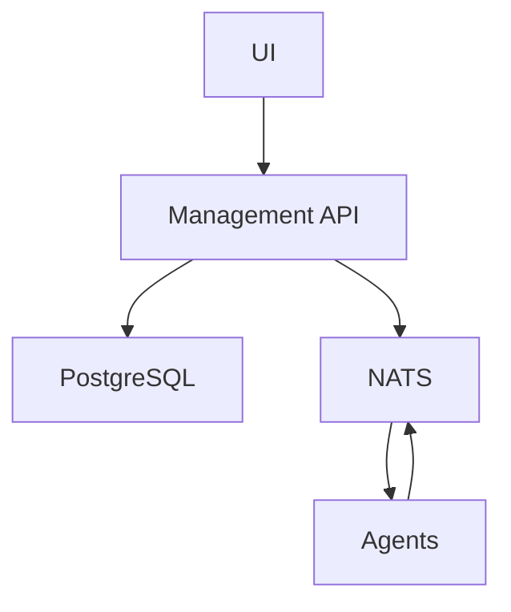

# Architecture Overview

## System Components

### 1. Management API
- **Technology Stack**: Python, FastAPI, SQLAlchemy
- **Key Responsibilities**:
  - User authentication and authorization
  - Configuration management
  - Agent management
  - Rule management
  - System monitoring

### 2. UI
- **Technology Stack**: React, TypeScript, Tailwind CSS
- **Key Responsibilities**:
  - User interface for system management
  - Real-time monitoring dashboard
  - Configuration interface
  - Agent management interface

### 3. Database
- **Technology**: PostgreSQL
- **Key Features**:
  - Persistent storage
  - Transaction support
  - Data integrity
  - Backup and recovery

### 4. Message Broker
- **Technology**: NATS
- **Key Features**:
  - Event-driven communication
  - Pub/sub messaging
  - Queue management
  - Real-time updates

## System Architecture

### Component Interaction

### Data Flow
1. **User Requests**:
   - UI → Management API
   - Management API → Database
   - Management API → NATS

2. **System Events**:
   - Agents → NATS
   - NATS → Management API
   - Management API → UI

## Security Architecture

### Authentication
- JWT-based authentication
- Role-based access control
- Session management
- API key management

### Data Security
- Encrypted communication (TLS)
- Secure credential storage
- Input validation
- Output sanitization

## Deployment Architecture

### Development
- Docker Compose for local development
- Hot-reload for UI and backend
- Local database instance
- Development NATS server

### Production
- Containerized deployment
- Load balancing
- Database replication
- High availability setup

## Monitoring and Logging

### System Monitoring
- Service health checks
- Resource utilization
- Performance metrics
- Error tracking

### Logging
- Application logs
- Access logs
- Error logs
- Audit logs

## Backup and Recovery

### Database Backup
- Automated daily backups
- Point-in-time recovery
- Backup verification
- Restore procedures

### System Recovery
- Service restart procedures
- Data recovery processes
- Configuration backup
- Disaster recovery plan

## Development Guidelines

### Code Organization
- Modular architecture
- Clear separation of concerns
- Consistent coding standards
- Comprehensive documentation

### Testing Strategy
- Unit testing
- Integration testing
- End-to-end testing
- Performance testing

## Future Considerations

### Scalability
- Horizontal scaling
- Load distribution
- Resource optimization
- Performance tuning

### Extensibility
- Plugin architecture
- API versioning
- Feature flags
- Configuration management

## Maintenance

### Regular Tasks
- Security updates
- Dependency updates
- Performance monitoring
- Capacity planning

### Emergency Procedures
- Incident response
- Service recovery
- Data restoration
- Communication plan
