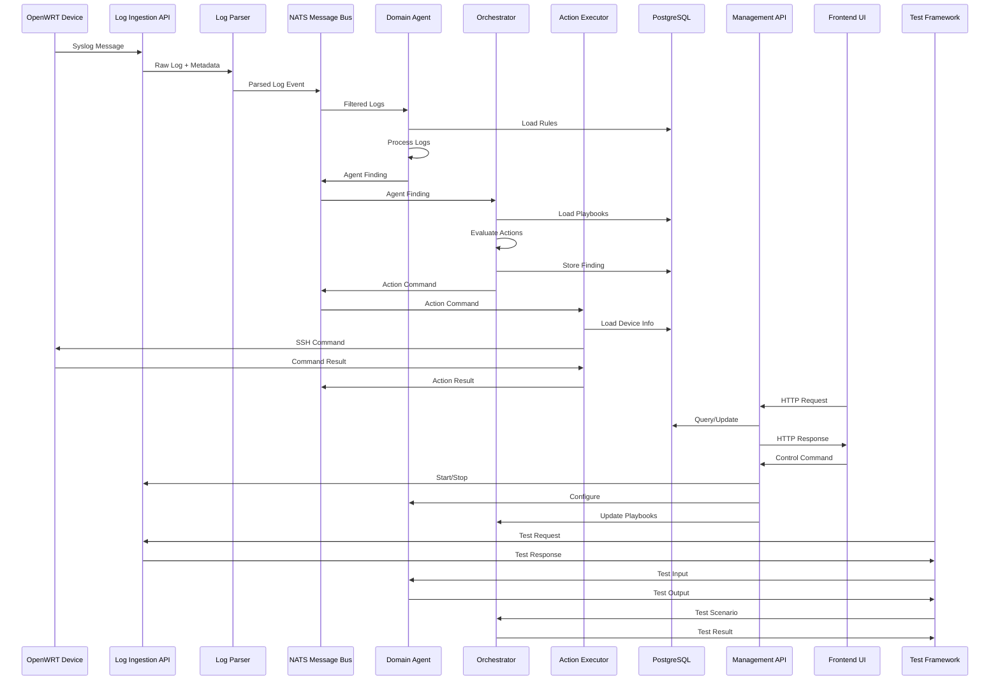

# OPMAS Component Interactions

## Component Communication Flow



## Message Types and Topics

### NATS Topics

1. **Log Topics**
   - `logs.parsed.raw`: All parsed logs
   - `logs.wifi`: WiFi-related logs
   - `logs.security`: Security-related logs
   - `logs.health`: Health-related logs
   - `logs.connectivity`: WAN/connectivity logs

2. **Finding Topics**
   - `findings.wifi`: WiFi agent findings
   - `findings.security`: Security agent findings
   - `findings.health`: Health agent findings
   - `findings.connectivity`: WAN agent findings

3. **Action Topics**
   - `actions.execute`: Commands to execute
   - `actions.results`: Action execution results

### Message Formats

1. **Parsed Log Event**
```json
{
  "event_id": "uuid",
  "arrival_ts_utc": "ISO-8601",
  "source_ip": "192.168.1.1",
  "original_ts": "Apr 18 15:02:17",
  "hostname": "OpenWRT-Router1",
  "process_name": "hostapd",
  "log_level": "INFO",
  "message": "wlan0: STA authenticated",
  "log_source_type": "wifi",
  "structured_fields": {
    "interface": "wlan0",
    "mac_address": "aa:bb:cc:dd:ee:ff",
    "event": "auth_success"
  }
}
```

2. **Agent Finding**
```json
{
  "finding_id": "uuid",
  "agent_name": "WiFiAgent",
  "finding_ts_utc": "ISO-8601",
  "device_hostname": "OpenWRT-Router1",
  "severity": "Warning",
  "finding_type": "HighAuthFailureRate",
  "description": "High rate of authentication failures",
  "details": {
    "interface": "wlan0",
    "client_mac": "aa:bb:cc:dd:ee:ff",
    "failure_count": 25,
    "time_window_seconds": 60
  }
}
```

3. **Action Command**
```json
{
  "action_id": "uuid",
  "command_ts_utc": "ISO-8601",
  "device_hostname": "OpenWRT-Router1",
  "action_type": "run_command",
  "command": "/usr/sbin/hostapd_cli -i wlan0 list_sta",
  "timeout_seconds": 30,
  "originating_finding_id": "uuid"
}
```

4. **Action Result**
```json
{
  "result_id": "uuid",
  "action_id": "uuid",
  "result_ts_utc": "ISO-8601",
  "device_hostname": "OpenWRT-Router1",
  "status": "Success",
  "exit_code": 0,
  "stdout": "Command output",
  "stderr": "",
  "error_message": ""
}
```

## Database Schema Overview

### Core Tables

1. **agents**
   - Agent definitions
   - Configuration
   - Status
   - Type (WiFi, Security, Health, WAN)
   - Timestamps

2. **log_entries**
   - Log event data
   - Source information
   - Timestamps
   - Structured fields

3. **findings**
   - Agent findings
   - Timestamps
   - Details
   - Severity
   - Status

4. **actions**
   - Action commands
   - Execution results
   - Timestamps
   - Status

5. **device_inventory**
   - Device information
   - Credentials
   - Status
   - Configuration

6. **ssh_keys**
   - Encrypted keys
   - Access control
   - Rotation info
