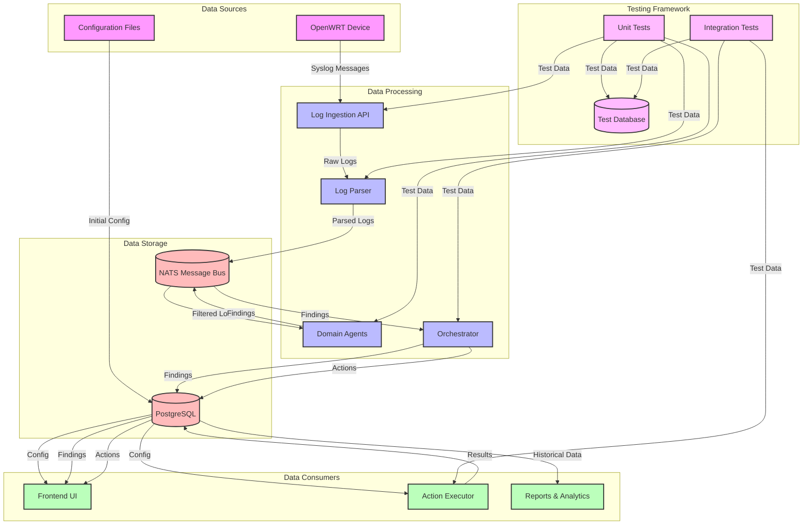
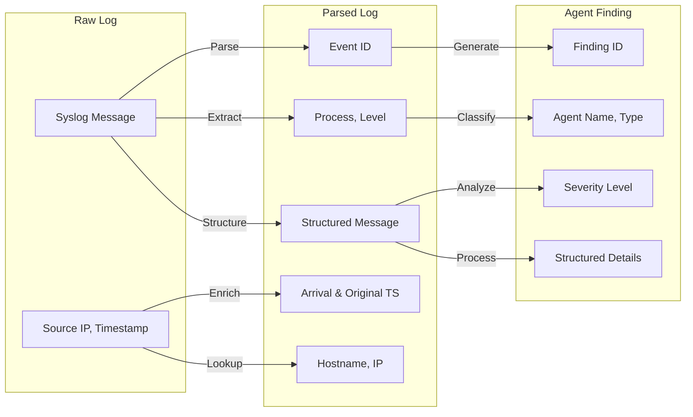
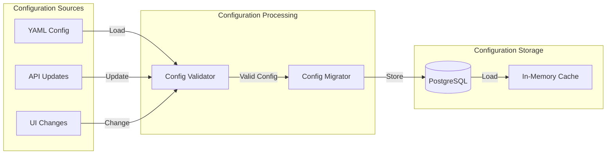
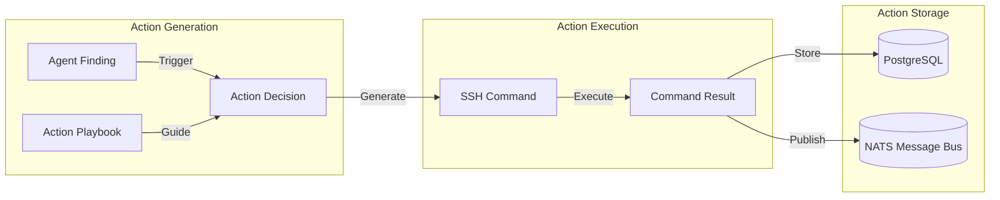
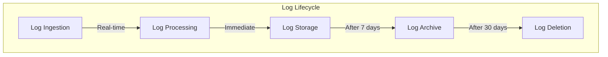
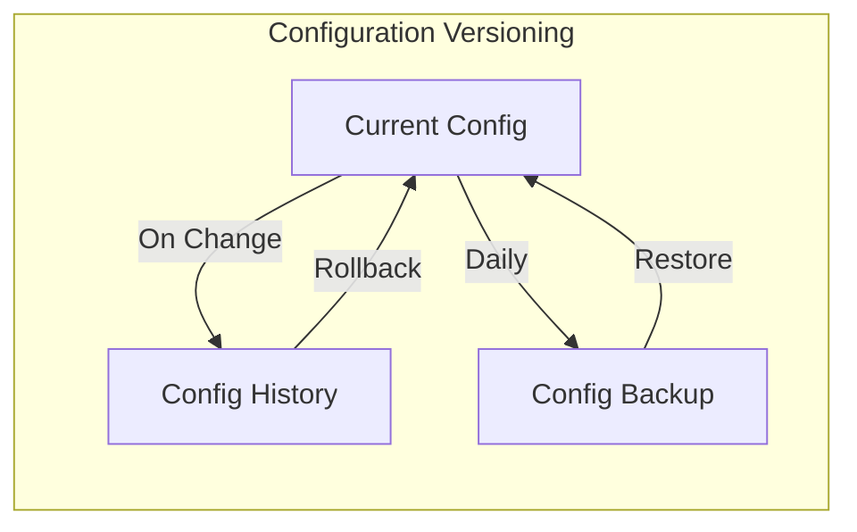
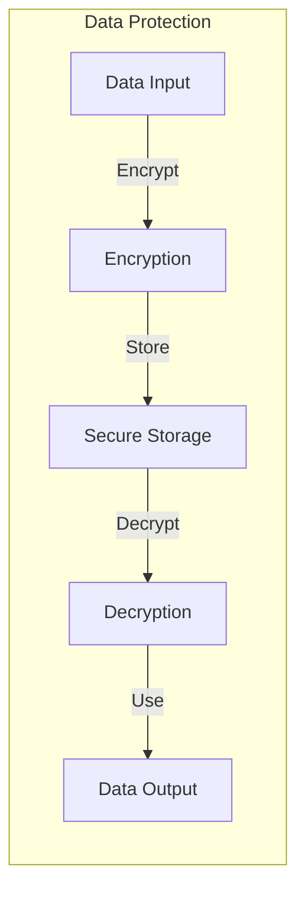
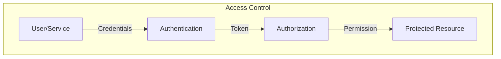

# OPMAS Data Flow

## System Data Flow

## Data Types and Transformations

### 1. Log Data Flow

### 2. Configuration Data Flow

### 3. Action Data Flow

## Data Retention and Cleanup

### 1. Log Retention Policy

### 2. Configuration Versioning

## Data Security

### 1. Data Encryption Flow

### 2. Access Control Flow

