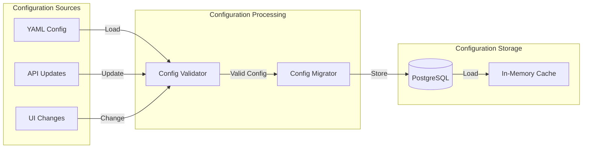
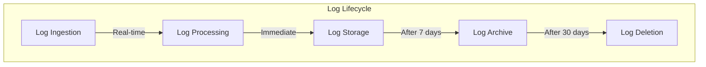
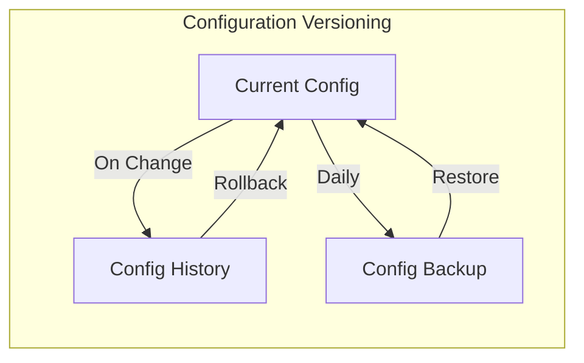
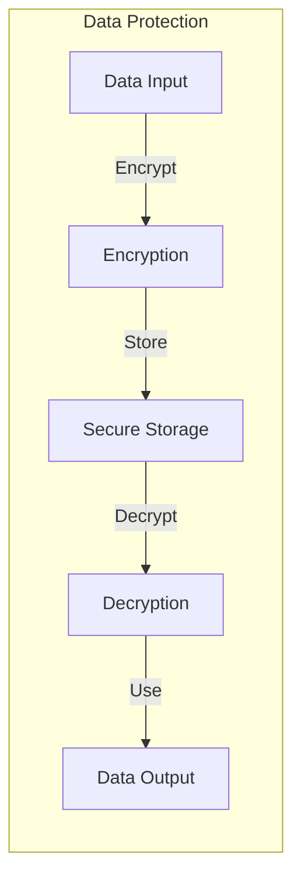

# OPMAS Data Flow

## System Data Flow

```mermaid
flowchart TB
    subgraph "External Systems"
        direction LR
        Device["OpenWRT Devices"]
    end

    subgraph "Configuration Sources"
        direction LR
        InitialConfig["Initial Config Files (YAML, env)"]
    end

    subgraph "OPMAS System"
        direction TB

        subgraph "Log Ingestion Layer"
            direction TB
            LogAPI_HTTP["Log Ingestion API (HTTP)<br/>(Parses, Publishes ParsedLogEvent)"]
            
            subgraph "Designed UDP Path (Not Default Active)"
                direction LR
                Syslog_UDP["Syslog UDP Ingestor"] --> Async_Queue["asyncio.Queue"]
                Async_Queue --> Parser_UDP["Parser (UDP Path)"]
            end
            
            subgraph "Designed TCP Path (Not Default Active)"
                direction LR
                Syslog_TCP["Syslog TCP Ingestor"] --> NATS_Raw["NATS (logs.parsed.raw)"]
                NATS_Raw --> Parser_TCP["Parser (TCP Path)"]
            end
        end

        subgraph "Core Processing Layer"
            direction TB
            DomainAgents["Domain Agents"]
            Orchestrator_Active["Orchestrator (Active)<br/>(Logs Findings to DB)"]
            Orchestrator_Core["Orchestrator (core/orchestrator.py - Designed)<br/>(Playbooks, IntendedActions)"]
            ActionExecutor["Action Executor (Future Scope)"]
        end

        subgraph "Management & UI Layer"
            direction LR
            MgmtAPI["Management API"]
            UI["Frontend UI"]
        end
    end

    subgraph "Shared Services"
        direction LR
        NATS_ParsedEvent["NATS (ParsedLogEvent Topics e.g., logs.wifi)"]
        NATS_Finding["NATS (AgentFinding Topics e.g., findings.wifi)"]
        PostgreSQL_DB["PostgreSQL Database"]
    end

    %% Data Input and Initial Config
    Device -->|Syslog| LogAPI_HTTP
    Device -->|Syslog (UDP)| Syslog_UDP
    Device -->|Syslog (TCP)| Syslog_TCP
    InitialConfig -->|Core Backend Config, Agent Rules (YAML)| DomainAgents
    InitialConfig -->|Core Backend Config| Orchestrator_Active
    InitialConfig -->|Management API Config| MgmtAPI
    InitialConfig -->|DB Schema & Initial Data| PostgreSQL_DB

    %% Log Processing Flow
    LogAPI_HTTP --> NATS_ParsedEvent
    Parser_UDP --> NATS_ParsedEvent
    Parser_TCP --> NATS_ParsedEvent
    
    NATS_ParsedEvent --> DomainAgents

    %% Agent & Orchestrator Flow (Active Path)
    DomainAgents -->|AgentFinding| NATS_Finding
    NATS_Finding --> Orchestrator_Active
    Orchestrator_Active -->|Stores Findings| PostgreSQL_DB
    Orchestrator_Active -->|Reads Agent Config| PostgreSQL_DB

    %% Designed Orchestrator Flow (core/orchestrator.py)
    NATS_Finding --> Orchestrator_Core
    Orchestrator_Core -->|Stores Findings, IntendedActions| PostgreSQL_DB
    Orchestrator_Core -->|Reads Agent Config, Playbooks| PostgreSQL_DB
    Orchestrator_Core -.->|Future: Commands to Execute| ActionExecutor

    %% UI & Management API Flow
    UI -->|HTTP REST Calls| MgmtAPI
    MgmtAPI -->|CRUD Config (Agents, Rules, Playbooks, Users), Reads Results| PostgreSQL_DB
    MgmtAPI <-->|Real-time updates / Commands?| NATS_ParsedEvent %% Could be any NATS topic
    InitialConfig -->|User Credentials Initial Setup| PostgreSQL_DB


    %% Styling
    classDef external fill:#E0E0E0,stroke:#333,stroke-width:2px
    classDef configsrc fill:#FFFACD,stroke:#333,stroke-width:2px
    classDef system fill:#F0F8FF,stroke:#333,stroke-width:2px
    classDef ingest fill:#D1E8E2,stroke:#333,stroke-width:2px
    classDef coreproc fill:#FFDAB9,stroke:#333,stroke-width:2px
    classDef mgmtui fill:#A2D2FF,stroke:#333,stroke-width:2px
    classDef shared fill:#BDE0FE,stroke:#333,stroke-width:2px
    classDef future fill:#lightgrey,stroke:#333,stroke-width:1px,stroke-dasharray: 5 5
    
    class Device external;
    class InitialConfig configsrc;
    class LogAPI_HTTP, Syslog_UDP, Async_Queue, Parser_UDP, Syslog_TCP, NATS_Raw, Parser_TCP ingest;
    class DomainAgents, Orchestrator_Active, Orchestrator_Core coreproc;
    class ActionExecutor future;
    class MgmtAPI, UI mgmtui;
    class NATS_ParsedEvent, NATS_Finding, PostgreSQL_DB shared;
```

## Data Types and Transformations
(This section's content remains as is from the original document for now, as the request was to update specific diagrams. If "Log Data Flow" was meant to replace "Data Types and Transformations > 1. Log Data Flow", I will adjust. Assuming "Log Data Flow" is a new title for the first diagram under "Data Types and Transformations".)

### 1. Log Data Flow
(Replacing the old "Log Data Flow" diagram under "Data Types and Transformations")
```mermaid
flowchart LR
    subgraph "Device Log Origin"
        RawSyslog["Raw Syslog Message<br/>(from OpenWRT Device)"]
    end

    subgraph "HTTP Ingestion Path (Default Active)"
        LogAPI_HTTP_Parse["Log Ingestion API (HTTP)"]
        ParsingUtils_HTTP["parsing_utils.py"]
        ParsedLogEvent_HTTP["ParsedLogEvent<br/>(Timestamp, Hostname, Process, Message, etc.)"]
    end
    
    RawSyslog --> LogAPI_HTTP_Parse
    LogAPI_HTTP_Parse --"Uses for Parsing & Classification"--> ParsingUtils_HTTP
    ParsingUtils_HTTP --> ParsedLogEvent_HTTP
    ParsedLogEvent_HTTP --> NATS_Bus1["NATS<br/>(e.g., logs.wifi)"]
    
    subgraph "Alternative Ingestion Paths (Designed)"
        direction TB
        Syslog_UDP_TCP["Syslog (UDP/TCP)"]
        Queue_Or_RawNATS["asyncio.Queue (UDP) /<br/>NATS (logs.parsed.raw) (TCP)"]
        DedicatedParsers["Dedicated Parsers<br/>(Parser_UDP / Parser_TCP)"]
        ParsedLogEvent_Alt["ParsedLogEvent"]
    end

    RawSyslog --> Syslog_UDP_TCP
    Syslog_UDP_TCP --> Queue_Or_RawNATS
    Queue_Or_RawNATS --> DedicatedParsers
    DedicatedParsers --> ParsedLogEvent_Alt
    ParsedLogEvent_Alt --> NATS_Bus2["NATS<br/>(e.g., logs.type)"]

    subgraph "Agent Processing"
        DomainAgent["Domain Agent"]
        AgentRules["Agent Rules<br/>(from YAML/env)"]
        AgentFinding["AgentFinding<br/>(Type, Severity, Details)"]
    end
    
    NATS_Bus1 --> DomainAgent
    NATS_Bus2 --> DomainAgent
    DomainAgent --"Applies"--> AgentRules
    DomainAgent --> AgentFinding
    AgentFinding --> NATS_Bus_Findings["NATS<br/>(e.g., findings.wifi)"]

    subgraph "Orchestrator & Storage"
        ActiveOrchestrator["Orchestrator (Active)"]
        DB_Findings["DB: findings table"]
    end

    NATS_Bus_Findings --> ActiveOrchestrator
    ActiveOrchestrator --> DB_Findings

    %% Styling
    classDef raw fill:#FFE4E1,stroke:#333,stroke-width:1px
    classDef process fill:#D1E8E2,stroke:#333,stroke-width:1px
    classDef data fill:#FFFACD,stroke:#333,stroke-width:1px
    classDef nats fill:#BDE0FE,stroke:#333,stroke-width:1px
    classDef storage fill:#FFDAB9,stroke:#333,stroke-width:1px

    class RawSyslog raw;
    class LogAPI_HTTP_Parse, ParsingUtils_HTTP, Syslog_UDP_TCP, Queue_Or_RawNATS, DedicatedParsers, DomainAgent, AgentRules, ActiveOrchestrator process;
    class ParsedLogEvent_HTTP, ParsedLogEvent_Alt, AgentFinding data;
    class NATS_Bus1, NATS_Bus2, NATS_Bus_Findings nats;
    class DB_Findings storage;
```

### 2. Configuration Data Flow
(Content remains as is)


### 3. Action Data Flow (Designed/Future Action Flow)
(Replacing the old "Action Data Flow" diagram)
```mermaid
flowchart LR
    style Orchestrator_Core fill:#C9FFD9,stroke:#228B22,stroke-width:2px
    style ActionExecutor fill:#lightgrey,stroke:#333,stroke-width:1px,stroke-dasharray: 5 5
    style FutureLabel fill:#grey,font-style:italic

    subgraph "Finding Input"
        Agent_Finding["AgentFinding<br/>(from NATS)"]
    end

    subgraph "Orchestration (Designed - core/orchestrator.py)"
        Orchestrator_Core["Orchestrator (core/orchestrator.py)"]
        Playbooks_DB["Playbooks<br/>(Read from DB)"]
        IntendedAction_DB["IntendedAction<br/>(Stored in DB)"]
    end
    
    Agent_Finding --> Orchestrator_Core
    Orchestrator_Core -- "Consults" --> Playbooks_DB
    Orchestrator_Core --> |"Logs"| IntendedAction_DB
    
    subgraph "Action Execution (Future Scope)"
        ActionExecutor_Node["Action Executor"]
        Device_Action["Target Device"]
        ExecutionResult["Command Result"]
        NATS_Results["NATS (actions.results)"]
        DB_Results["DB (Action Results)"]
    end

    Orchestrator_Core -.->|Future: NATS (actions.execute)| ActionExecutor_Node
    ActionExecutor_Node -.->|Future: SSH Command| Device_Action
    Device_Action -.->|Future: Output/Status| ActionExecutor_Node
    ActionExecutor_Node -.->|Future: Logs Result| DB_Results
    ActionExecutor_Node -.->|Future: Publishes Result| NATS_Results
    
    %% Labels for current state
    note_action ["Note: Current default Orchestrator<br/>(backend/src/opmas/orchestrator.py)<br/>does not perform this playbook/IntendedAction flow.<br/>It primarily logs findings to DB."]
    subgraph Orchestration_Note_Action [ ]
        direction LR
        note_action
    end

    classDef finding fill:#FFDAB9,stroke:#333,stroke-width:1px
    classDef orchestrator fill:#C9FFD9,stroke:#333,stroke-width:1px
    classDef database fill:#BDE0FE,stroke:#333,stroke-width:1px
    classDef future fill:#E0E0E0,stroke:#333,stroke-width:1px,stroke-dasharray: 3 3
    classDef device fill:#E0E0E0,stroke:#333,stroke-width:1px

    class Agent_Finding finding;
    class Orchestrator_Core orchestrator;
    class Playbooks_DB, IntendedAction_DB, DB_Results database;
    class ActionExecutor_Node, Device_Action, ExecutionResult, NATS_Results future;
```

## Data Retention and Cleanup
(Content remains as is)
### 1. Log Retention Policy


### 2. Configuration Versioning


## Data Security
(Content remains as is)
### 1. Data Encryption Flow


### 2. Access Control Flow
(Replacing the old "Access Control Flow" diagram)
```mermaid
flowchart TB
    subgraph "User/Client"
        User_Auth["User / External Client"]
        Browser_CLI_Auth["Browser / CLI Tool"]
    end

    subgraph "Authentication & Authorization (Management API)"
        Mgmt_API_Login["Mgmt API: /login Endpoint"]
        TokenService["JWT Service<br/>(Issues Tokens)"]
        UserCredentialsDB["DB: users table<br/>(Hashed Passwords, Roles)"]
        ProtectedResource["Mgmt API: Protected Resource<br/>(e.g., /agents, /control/start)"]
        AuthZ_Logic["Authorization Logic<br/>(Checks token validity, user active, roles if any)"]
    end

    User_Auth -->|1. Enters Credentials| Browser_CLI_Auth
    Browser_CLI_Auth -->|2. Sends Credentials (username, password)| Mgmt_API_Login
    Mgmt_API_Login -->|3. Verifies Credentials| UserCredentialsDB
    UserCredentialsDB -->|4. User Data / Validation| Mgmt_API_Login
    Mgmt_API_Login -->|5. Issues Token Request| TokenService
    TokenService -->|6. Returns JWT (Access/Refresh)| Mgmt_API_Login
    Mgmt_API_Login -->|7. Sends JWT to Client| Browser_CLI_Auth
    Browser_CLI_Auth -->|8. Stores JWT (e.g., localStorage)| User_Auth

    User_Auth -->|9. Subsequent Request with JWT| Browser_CLI_Auth
    Browser_CLI_Auth -->|10. HTTP Request with 'Authorization: Bearer JWT'| ProtectedResource
    ProtectedResource --"11. Validates Token & Authorizes"--> AuthZ_Logic
    AuthZ_Logic -->|12. Token Claims (user_id, roles)| ProtectedResource
    AuthZ_Logic -->|13. Access Granted/Denied| ProtectedResource
    ProtectedResource -->|14. Response / Error| Browser_CLI_Auth
    Browser_CLI_Auth -->|15. Displays Result / Handles Error| User_Auth
    
    %% Styling
    classDef client fill:#D1E8E2,stroke:#333,stroke-width:1px
    classDef api fill:#A2D2FF,stroke:#333,stroke-width:1px
    classDef db fill:#BDE0FE,stroke:#333,stroke-width:1px

    class User_Auth, Browser_CLI_Auth client;
    class Mgmt_API_Login, TokenService, ProtectedResource, AuthZ_Logic api;
    class UserCredentialsDB db;
```
