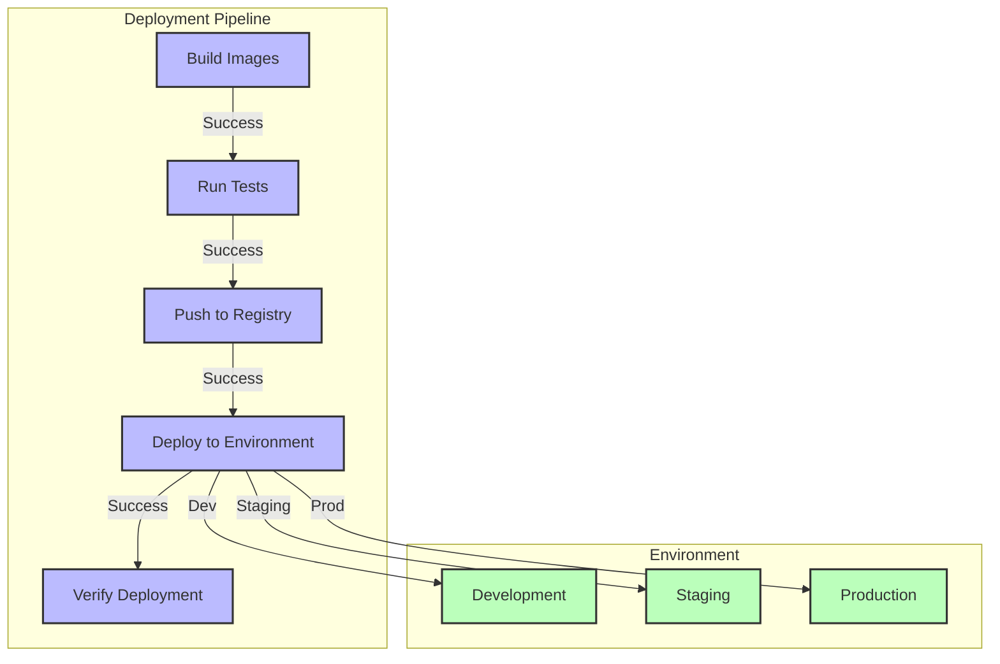

# OPMAS Deployment Architecture

## Development Environment

```mermaid
graph TB
    subgraph "Development Machine (Host)"
        direction LR
        subgraph "Development Tools"
            direction TB
            IDE["IDE (e.g., VS Code)"]
            GitClient["Git Client"]
            DockerDesktop["Docker Desktop / Engine"]
            NodeJS["Node.js (for UI dev if running outside Docker)"]
            PythonEnv["Python Env (for backend dev if running outside Docker)"]
        end
        subgraph "OPMAS Services (via Docker Compose)"
            direction TB
            CoreBackend["Core Backend (backend/)"]
            ManagementAPI["Management API"]
            FrontendUI["Frontend UI"]
            NATS_Dev["NATS Server"]
            Postgres_Dev["PostgreSQL DB"]
            Redis_Dev["Redis Cache"]
            Prometheus_Dev["Prometheus (Monitoring)"]
            Grafana_Dev["Grafana (Dashboards)"]
        end
    end

    subgraph "External Test Devices (Optional)"
        direction TB
        Device1_Dev["OpenWRT Device 1"]
        Device2_Dev["OpenWRT Device 2"]
    end

    %% Connections within Docker Compose (handled by opmas_network)
    CoreBackend -->|NATS pub/sub| NATS_Dev
    CoreBackend -->|DB queries| Postgres_Dev
    CoreBackend -->|Cache (potential)| Redis_Dev
    ManagementAPI -->|DB queries| Postgres_Dev
    ManagementAPI -->|Cache (potential)| Redis_Dev
    ManagementAPI -->|NATS pub/sub| NATS_Dev
    FrontendUI -->|HTTP API Calls| ManagementAPI
    Prometheus_Dev -->|Scrapes metrics| CoreBackend
    Prometheus_Dev -->|Scrapes metrics| ManagementAPI
    Prometheus_Dev -->|Scrapes metrics| NATS_Dev
    Grafana_Dev -->|Queries metrics| Prometheus_Dev
    
    %% Optional connections if backend/UI run partially outside Docker
    PythonEnv --> CoreBackend
    NodeJS --> FrontendUI

    %% Connections to external test devices
    CoreBackend -->|Syslog (from device), SSH (to device - future)| Device1_Dev
    CoreBackend -->|Syslog (from device), SSH (to device - future)| Device2_Dev
    
    classDef host fill:#ECECEC,stroke:#333,stroke-width:2px
    classDef tools fill:#D1E8E2,stroke:#333,stroke-width:1px
    classDef services fill:#A2D2FF,stroke:#333,stroke-width:1px
    classDef external fill:#FFDAB9,stroke:#333,stroke-width:1px
    
    class IDE,GitClient,DockerDesktop,NodeJS,PythonEnv tools;
    class CoreBackend,ManagementAPI,FrontendUI,NATS_Dev,Postgres_Dev,Redis_Dev,Prometheus_Dev,Grafana_Dev services;
    class Device1_Dev,Device2_Dev external;
```

## Production Environment

```mermaid
graph TB
    subgraph "User / External Systems"
        direction TB
        Users["Users (via Browser)"]
        MonitoredDevices["Monitored OpenWRT Devices"]
    end

    subgraph "Cloud / Data Center (Production)"
        direction TB
        LB["Load Balancer / Ingress<br/>(e.g., Nginx, Cloud LB)"]
        
        subgraph "Container Orchestration Platform (e.g., Kubernetes)"
            direction LR
            subgraph "OPMAS Applications"
                direction TB
                CoreApp["Core Backend App (Replicas)"]
                MgmtAPIApp["Management API App (Replicas)"]
                UIApp["Frontend UI App (Replicas)"]
            end
            
            subgraph "Managed Backend Services"
                direction TB
                NATS_Prod["NATS Cluster"]
                Postgres_Prod["PostgreSQL Cluster / HA DB"]
                Redis_Prod["Redis Cluster / HA Cache"]
            end
            
            subgraph "Monitoring & Logging Stack"
                direction TB
                Prometheus_Prod["Prometheus"]
                Grafana_Prod["Grafana"]
                CentralizedLogging["Centralized Logging<br/>(e.g., ELK, Loki)"]
            end
        end
    end

    %% User Flow
    Users --> LB
    LB --> UIApp
    LB --> MgmtAPIApp

    %% Device Flow
    MonitoredDevices -->|Syslog, Telemetry| LB  
    LB -->|Forwarded Logs| CoreApp
    CoreApp -->|SSH (Future for Actions)| MonitoredDevices

    %% Internal Application Connections
    UIApp -->|API Calls| MgmtAPIApp
    MgmtAPIApp -->|DB Operations| Postgres_Prod
    MgmtAPIApp -->|Caching| Redis_Prod
    MgmtAPIApp -->|NATS (Optional Commands/Events)| NATS_Prod
    CoreApp -->|NATS Messaging| NATS_Prod
    CoreApp -->|DB Operations| Postgres_Prod
    CoreApp -->|Caching (Optional)| Redis_Prod
    
    %% Monitoring
    CoreApp -->|Metrics| Prometheus_Prod
    MgmtAPIApp -->|Metrics| Prometheus_Prod
    UIApp -->|Metrics (Client-side)| Prometheus_Prod
    NATS_Prod -->|Metrics| Prometheus_Prod
    Postgres_Prod -->|Metrics| Prometheus_Prod
    Redis_Prod -->|Metrics| Prometheus_Prod
    Prometheus_Prod -->|Data Source| Grafana_Prod
    CoreApp -->|Logs| CentralizedLogging
    MgmtAPIApp -->|Logs| CentralizedLogging
    
    classDef user_external fill:#E0E0E0,stroke:#333,stroke-width:2px
    classDef infra fill:#BDE0FE,stroke:#333,stroke-width:2px
    classDef app fill:#A2D2FF,stroke:#333,stroke-width:1px
    classDef managedservice fill:#D1E8E2,stroke:#333,stroke-width:1px
    classDef monitoring fill:#FFFACD,stroke:#333,stroke-width:1px

    class Users,MonitoredDevices user_external;
    class LB infra;
    class CoreApp,MgmtAPIApp,UIApp app;
    class NATS_Prod,Postgres_Prod,Redis_Prod managedservice;
    class Prometheus_Prod,Grafana_Prod,CentralizedLogging monitoring;
```

## Deployment Configuration

This section outlines the configuration for different OPMAS deployment scenarios.

### 1. Docker Compose (Development Environment)

The primary setup for local development and testing is managed by the `docker-compose.yaml` file located at the root of the monorepo. This file defines and orchestrates all necessary services for a full-stack OPMAS environment.

**Key Services defined in the root `docker-compose.yaml`:**

*   **`core` (Core Backend):**
    *   Builds from: `context: ./core` (Note: This should ideally be `context: ./backend` to match the project structure. If it's `./core`, a symlink or specific project setup might be in place.)
    *   Dockerfile: `backend/Dockerfile` (implied by `core` service context)
    *   Volumes: Mounts the local backend code for live reloading (e.g., `./core:/app`).
    *   Environment: Sets `PYTHONPATH`, `OPMAS_CONFIG_PATH`, `DEBUG=true`.
    *   Depends on: `nats`, `postgres`, `redis`.
*   **`management_api` (Management API):**
    *   Builds from: `context: .`, Dockerfile: `management_api/Dockerfile`.
    *   Ports: Maps host port `8000` to container port `8000`.
    *   Environment: Sets `DEBUG`, `CORS_ORIGINS`, JWT authentication variables.
    *   Depends on: `core`.
*   **`ui` (Frontend UI):**
    *   Builds from: `context: ./ui`, Dockerfile: `ui/Dockerfile`.
    *   Ports: Maps host port `3000` to container port `3000`.
    *   Environment: Sets `VITE_API_URL=http://localhost:8000` to point to the `management_api` service.
    *   Depends on: `management_api`.
*   **`nats` (NATS Message Broker):**
    *   Image: `nats:latest`.
    *   Ports: `4222` (client), `8222` (monitoring).
*   **`postgres` (PostgreSQL Database):**
    *   Image: `postgres:15-alpine`.
    *   Environment: `POSTGRES_USER=opmas`, `POSTGRES_PASSWORD=opmas`, `POSTGRES_DB=opmas`.
    *   Volumes: `postgres_data` for persistent storage.
    *   Ports: `5432`.
*   **`redis` (Redis Cache):**
    *   Image: `redis:7-alpine`.
    *   Ports: `6379`.
    *   Volumes: `redis_data` for persistent storage.
    *   Command: Enables AOF persistence.
*   **`prometheus` (Monitoring):**
    *   Image: `prom/prometheus:latest`.
    *   Volumes: Mounts Prometheus configuration (`./config/prometheus`) and data volume.
    *   Ports: `9090`.
*   **`grafana` (Dashboards):**
    *   Image: `grafana/grafana:latest`.
    *   Volumes: Grafana data volume.
    *   Ports: `3001` (maps to container port `3000`).
    *   Depends on: `prometheus`.

All services are connected via a custom bridge network named `opmas_network`. This setup provides a self-contained environment for developing and testing OPMAS features.

A secondary `backend/docker-compose.yaml` also exists, primarily used by `backend/start_opmas.sh` to quickly start NATS and PostgreSQL when running Core Backend Python components directly on the host. Note that database credentials in this file (`opmas_user`, `opmas_password`, `opmas_db`) differ from the root `docker-compose.yaml`.

### 2. Kubernetes (Production - Conceptual Example)

For production environments, a container orchestration platform like Kubernetes is recommended for scalability, resilience, and manageability. The following are conceptual Kubernetes manifest snippets, illustrating how OPMAS components might be deployed. Actual production configurations will vary based on specific requirements (ingress controllers, storage classes, secrets management, etc.).

**Note:** The Kubernetes configurations below are illustrative examples. Actual production deployments would require more detailed configurations, including persistent volume claims, secrets management for sensitive data (like database credentials and JWT secrets), ingress controller setup for external access, liveness/readiness probes, resource requests/limits, and potentially Horizontal Pod Autoscalers.

```yaml
# Core Backend Deployment
apiVersion: apps/v1
kind: Deployment
metadata:
  name: opmas-core
spec:
  replicas: 3 # Example: Start with 3 replicas
  selector:
    matchLabels:
      app: opmas-core
  template:
    metadata:
      labels:
        app: opmas-core
    spec:
      containers:
      - name: core
        image: your-registry/opmas-backend:latest # Replace with actual image path
        ports:
        - containerPort: 80 # Assuming the Core (e.g. Log API if it exposes HTTP) runs on port 80 internally or is managed by a process manager
        env:
        - name: NATS_URL
          value: "nats://nats-service:4222" # Using Kubernetes service DNS
        - name: DATABASE_URL
          valueFrom:
            secretKeyRef:
              name: opmas-db-secrets
              key: db-connection-string
        - name: OPMAS_CONFIG_PATH 
          value: "/app/config/opmas_config.yaml" # Assuming config is part of the image or a ConfigMap
        # Add volumeMounts for config if using ConfigMaps

# Management API Deployment
apiVersion: apps/v1
kind: Deployment
metadata:
  name: opmas-management-api
spec:
  replicas: 2 # Example: Start with 2 replicas
  selector:
    matchLabels:
      app: opmas-management-api
  template:
    metadata:
      labels:
        app: opmas-management-api
    spec:
      containers:
      - name: management-api
        image: your-registry/opmas-management-api:latest # Replace with actual image path
        ports:
        - containerPort: 8000
        env:
        - name: DATABASE_URL
          valueFrom:
            secretKeyRef:
              name: opmas-db-secrets
              key: db-connection-string
        - name: NATS_URL # If Management API uses NATS
          value: "nats://nats-service:4222"
        - name: AUTH_JWT_SECRET
          valueFrom:
            secretKeyRef:
              name: opmas-api-secrets
              key: jwt-secret
        # ... other environment variables for JWT config, CORS, etc.

# Frontend Deployment
apiVersion: apps/v1
kind: Deployment
metadata:
  name: opmas-frontend
spec:
  replicas: 2 # Example: Start with 2 replicas
  selector:
    matchLabels:
      app: opmas-frontend
  template:
    metadata:
      labels:
        app: opmas-frontend
    spec:
      containers:
      - name: frontend
        image: your-registry/opmas-ui:latest # Replace with actual image path
        ports:
        - containerPort: 3000 # Or the port your UI serves on
        env:
        - name: VITE_API_URL # Or appropriate env var for your UI build
          value: "http://opmas-management-api-service:8000" # Using K8s service DNS for internal API endpoint

# --- Example Services (not exhaustive) ---
# Service for Management API
apiVersion: v1
kind: Service
metadata:
  name: opmas-management-api-service
spec:
  selector:
    app: opmas-management-api
  ports:
    - protocol: TCP
      port: 8000 # External port service listens on
      targetPort: 8000 # Container port
  type: ClusterIP # Or LoadBalancer if exposing directly (less common for APIs)

# Service for NATS
apiVersion: v1
kind: Service
metadata:
  name: nats-service
spec:
  selector:
    app: nats # Assuming your NATS deployment has this label
  ports:
    - name: client
      protocol: TCP
      port: 4222
      targetPort: 4222
    - name: monitoring
      protocol: TCP
      port: 8222
      targetPort: 8222
  type: ClusterIP
```

## Deployment Process


