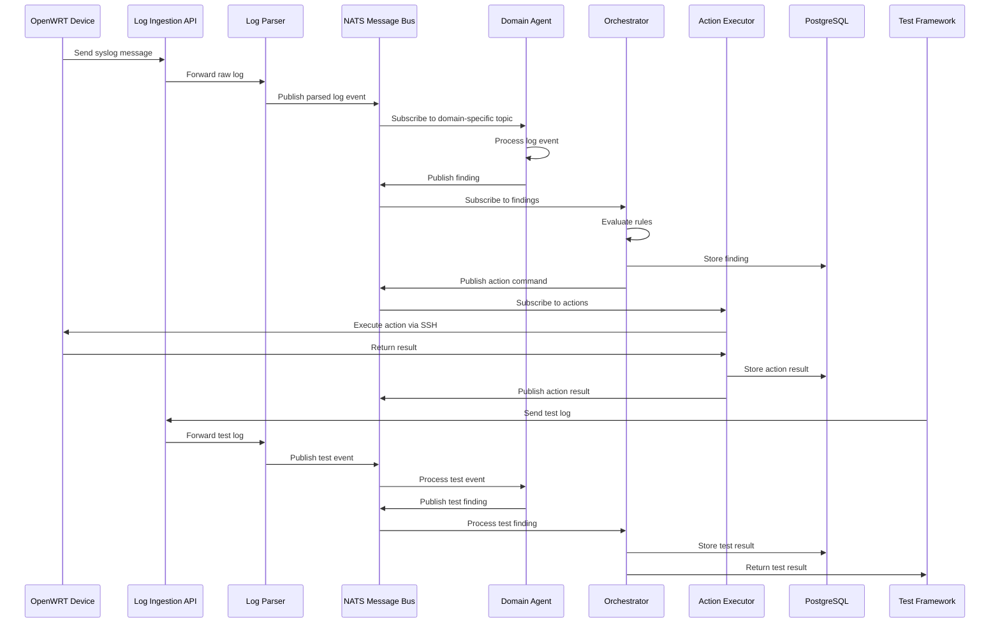
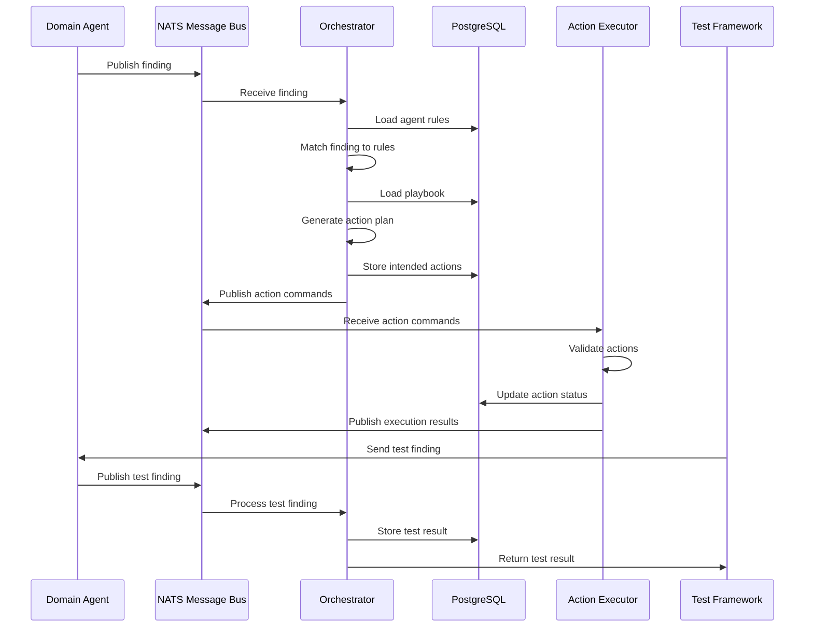
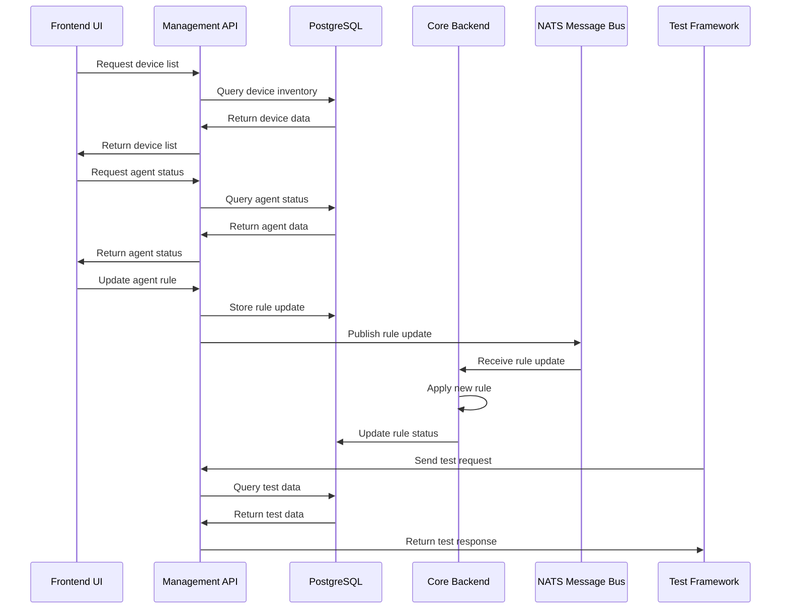
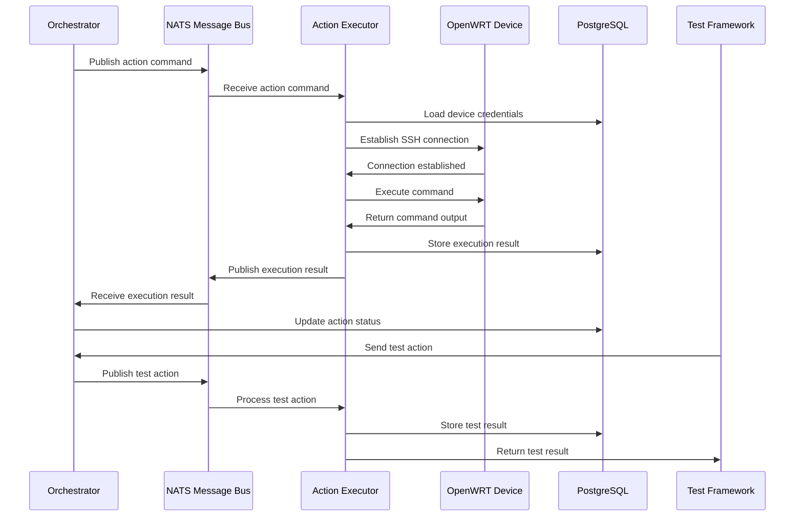
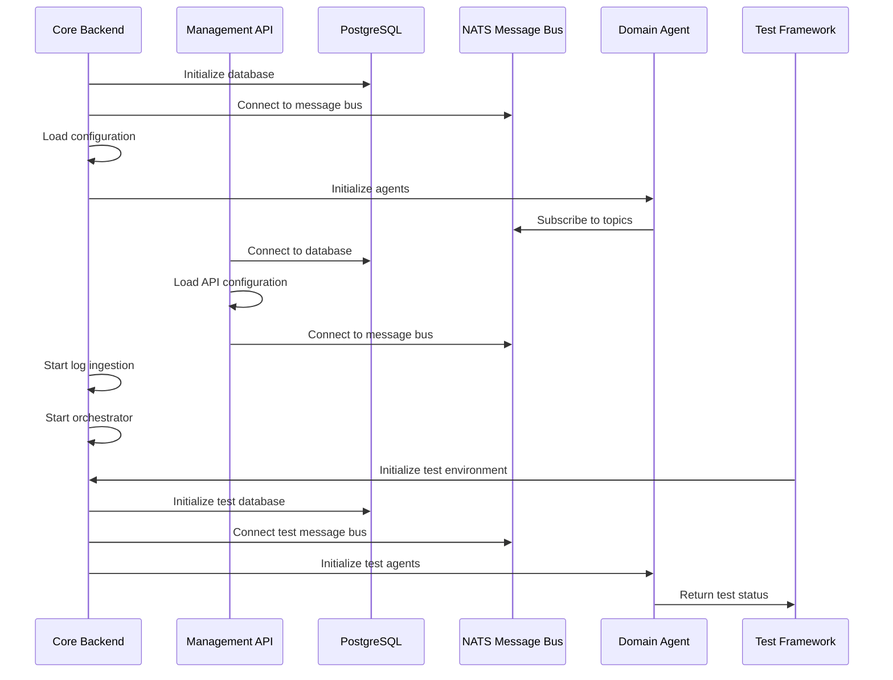
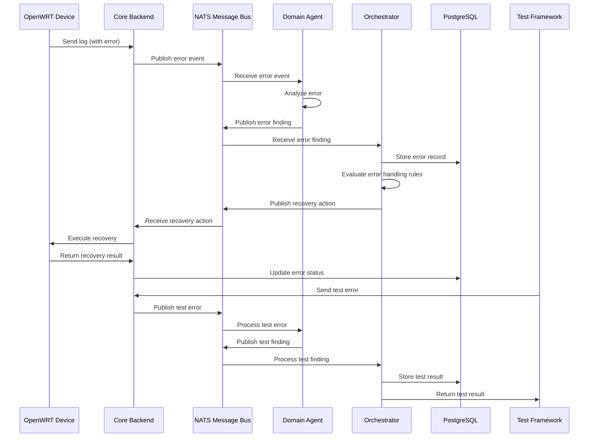

# OPMAS Sequence Diagrams

## Log Processing Flow

```mermaid
sequenceDiagram
    participant Device as OpenWRT Device
    participant LogAPI as Log Ingestion API
    participant Parser as Log Parser
    participant NATS as NATS Message Bus
    participant Agent as Domain Agent
    participant Orch as Orchestrator
    participant Exec as Action Executor
    participant DB as PostgreSQL
    participant Test as Test Framework

    Device->>LogAPI: Send syslog message
    LogAPI->>Parser: Forward raw log
    Parser->>NATS: Publish parsed log event
    NATS->>Agent: Subscribe to domain-specific topic
    Agent->>Agent: Process log event
    Agent->>NATS: Publish finding
    NATS->>Orch: Subscribe to findings
    Orch->>Orch: Evaluate rules
    Orch->>DB: Store finding
    Orch->>NATS: Publish action command
    NATS->>Exec: Subscribe to actions
    Exec->>Device: Execute action via SSH
    Device->>Exec: Return result
    Exec->>DB: Store action result
    Exec->>NATS: Publish action result

    %% Testing Flow
    Test->>LogAPI: Send test log
    LogAPI->>Parser: Forward test log
    Parser->>NATS: Publish test event
    NATS->>Agent: Process test event
    Agent->>NATS: Publish test finding
    NATS->>Orch: Process test finding
    Orch->>DB: Store test result
    Orch->>Test: Return test result
```

## Agent Rule Evaluation

```mermaid
sequenceDiagram
    participant Agent as Domain Agent
    participant NATS as NATS Message Bus
    participant Orch as Orchestrator
    participant DB as PostgreSQL
    participant Exec as Action Executor
    participant Test as Test Framework

    Agent->>NATS: Publish finding
    NATS->>Orch: Receive finding
    Orch->>DB: Load agent rules
    Orch->>Orch: Match finding to rules
    Orch->>DB: Load playbook
    Orch->>Orch: Generate action plan
    Orch->>DB: Store intended actions
    Orch->>NATS: Publish action commands
    NATS->>Exec: Receive action commands
    Exec->>Exec: Validate actions
    Exec->>DB: Update action status
    Exec->>NATS: Publish execution results

    %% Testing Flow
    Test->>Agent: Send test finding
    Agent->>NATS: Publish test finding
    NATS->>Orch: Process test finding
    Orch->>DB: Store test result
    Orch->>Test: Return test result
```

## Management API Interactions

```mermaid
sequenceDiagram
    participant UI as Frontend UI
    participant API as Management API
    participant DB as PostgreSQL
    participant Core as Core Backend
    participant NATS as NATS Message Bus
    participant Test as Test Framework

    UI->>API: Request device list
    API->>DB: Query device inventory
    DB->>API: Return device data
    API->>UI: Return device list

    UI->>API: Request agent status
    API->>DB: Query agent status
    DB->>API: Return agent data
    API->>UI: Return agent status

    UI->>API: Update agent rule
    API->>DB: Store rule update
    API->>NATS: Publish rule update
    NATS->>Core: Receive rule update
    Core->>Core: Apply new rule
    Core->>DB: Update rule status

    %% Testing Flow
    Test->>API: Send test request
    API->>DB: Query test data
    DB->>API: Return test data
    API->>Test: Return test response
```

## Action Execution Flow

```mermaid
sequenceDiagram
    participant Orch as Orchestrator
    participant NATS as NATS Message Bus
    participant Exec as Action Executor
    participant Device as OpenWRT Device
    participant DB as PostgreSQL
    participant Test as Test Framework

    Orch->>NATS: Publish action command
    NATS->>Exec: Receive action command
    Exec->>DB: Load device credentials
    Exec->>Device: Establish SSH connection
    Device->>Exec: Connection established
    Exec->>Device: Execute command
    Device->>Exec: Return command output
    Exec->>DB: Store execution result
    Exec->>NATS: Publish execution result
    NATS->>Orch: Receive execution result
    Orch->>DB: Update action status

    %% Testing Flow
    Test->>Orch: Send test action
    Orch->>NATS: Publish test action
    NATS->>Exec: Process test action
    Exec->>DB: Store test result
    Exec->>Test: Return test result
```

## System Initialization

```mermaid
sequenceDiagram
    participant Core as Core Backend
    participant API as Management API
    participant DB as PostgreSQL
    participant NATS as NATS Message Bus
    participant Agent as Domain Agent
    participant Test as Test Framework

    Core->>DB: Initialize database
    Core->>NATS: Connect to message bus
    Core->>Core: Load configuration
    Core->>Agent: Initialize agents
    Agent->>NATS: Subscribe to topics
    API->>DB: Connect to database
    API->>API: Load API configuration
    API->>NATS: Connect to message bus
    Core->>Core: Start log ingestion
    Core->>Core: Start orchestrator

    %% Testing Flow
    Test->>Core: Initialize test environment
    Core->>DB: Initialize test database
    Core->>NATS: Connect test message bus
    Core->>Agent: Initialize test agents
    Agent->>Test: Return test status
```

## Error Handling Flow

```mermaid
sequenceDiagram
    participant Device as OpenWRT Device
    participant Core as Core Backend
    participant NATS as NATS Message Bus
    participant Agent as Domain Agent
    participant Orch as Orchestrator
    participant DB as PostgreSQL
    participant Test as Test Framework

    Device->>Core: Send log (with error)
    Core->>NATS: Publish error event
    NATS->>Agent: Receive error event
    Agent->>Agent: Analyze error
    Agent->>NATS: Publish error finding
    NATS->>Orch: Receive error finding
    Orch->>DB: Store error record
    Orch->>Orch: Evaluate error handling rules
    Orch->>NATS: Publish recovery action
    NATS->>Core: Receive recovery action
    Core->>Device: Execute recovery
    Device->>Core: Return recovery result
    Core->>DB: Update error status

    %% Testing Flow
    Test->>Core: Send test error
    Core->>NATS: Publish test error
    NATS->>Agent: Process test error
    Agent->>NATS: Publish test finding
    NATS->>Orch: Process test finding
    Orch->>DB: Store test result
    Orch->>Test: Return test result
```
