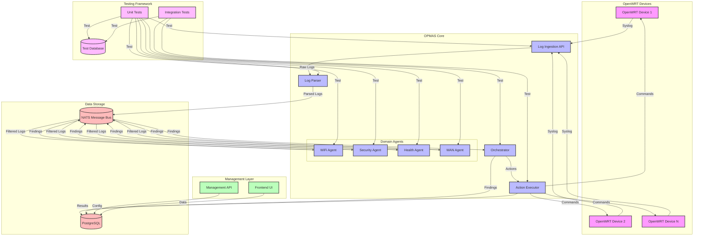

# OPMAS System Overview

## High-Level Architecture

## Component Descriptions

### OpenWRT Devices
- Network devices running OpenWRT
- Configured to forward logs via syslog
- Accessible via SSH for action execution

### OPMAS Core
1. **Log Ingestion API**
   - Receives syslog messages from devices
   - Validates and timestamps incoming logs
   - Forwards to Log Parser

2. **Log Parser**
   - Parses raw log messages
   - Classifies logs by type
   - Publishes to NATS topics

3. **Domain Agents**
   - Subscribe to relevant log topics
   - Apply domain-specific rules
   - Generate findings

4. **Orchestrator**
   - Processes agent findings
   - Consults playbooks
   - Decides on actions

5. **Action Executor**
   - Executes commands on devices
   - Manages SSH connections
   - Reports results

### Management Layer
1. **Management API**
   - RESTful API for system control
   - Configuration management
   - Status monitoring

2. **Frontend UI**
   - Web-based interface
   - Real-time monitoring
   - Configuration management

### Data Storage
- **PostgreSQL**
  - Stores system configuration
  - Maintains device inventory
  - Records findings and actions
  - Manages playbooks and rules
