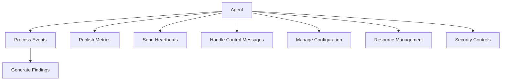
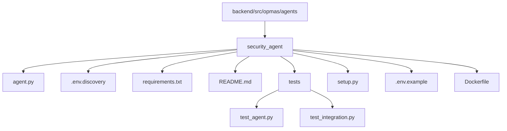
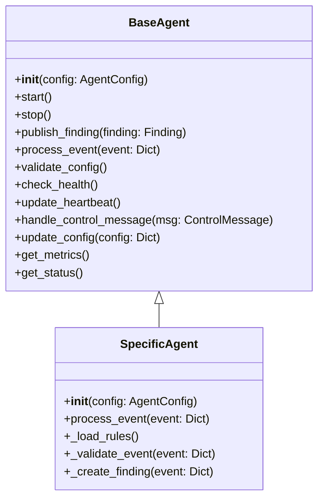
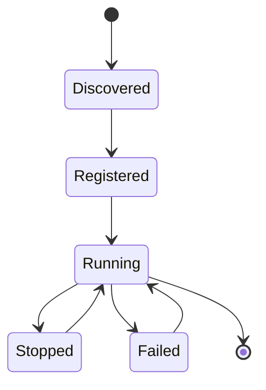
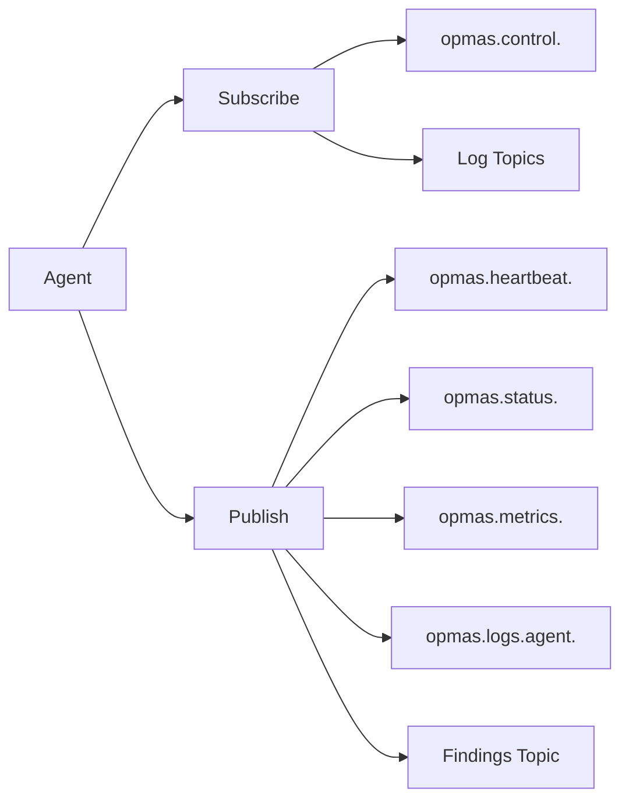
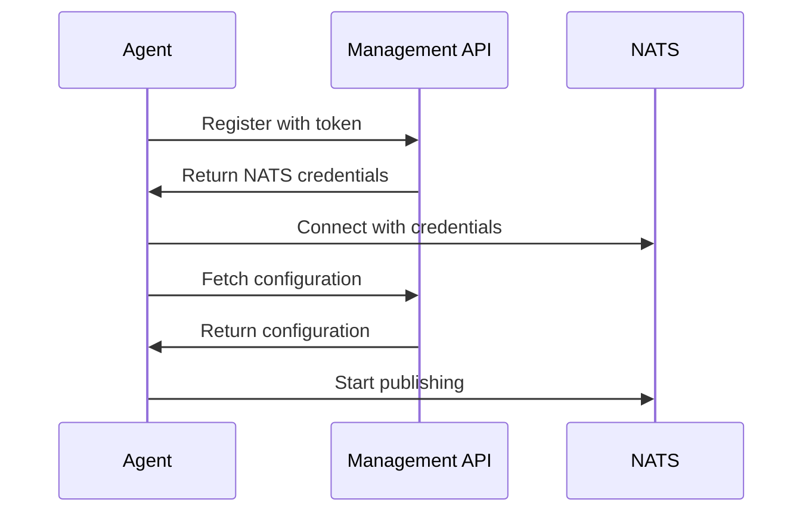

# Agent Package Design Specification for OPMAS (v1.0)

**Date:** 2025-05-27
**Location:** Huntington Beach, California, United States

This specification outlines the structure, configuration, implementation, and communication requirements for an agent package in OPMAS. The goal is to ensure that any new agent dropped into the system is automatically detected, registered, launched, and managed effectively.

## Table of Contents

- [Agent Package Design Specification for OPMAS (v1.0)](#agent-package-design-specification-for-opmas-v10)
  - [Table of Contents](#table-of-contents)
  - [1. Overview](#1-overview)
  - [2. Package Structure](#2-package-structure)
    - [Required Files](#required-files)
    - [Example Directory Layout](#example-directory-layout)
  - [3. Configuration](#3-configuration)
    - [Discovery (.env.discovery)](#discovery-envdiscovery)
    - [Operational Configuration](#operational-configuration)
  - [4. BaseAgent Implementation](#4-baseagent-implementation)
    - [Core Functionality](#core-functionality)
    - [Lifecycle Management](#lifecycle-management)
  - [5. Agent Implementation](#5-agent-implementation)
  - [6. NATS Communication](#6-nats-communication)
    - [Topics](#topics)
      - [Subscribe](#subscribe)
      - [Publish](#publish)
    - [Message Formats](#message-formats)
  - [7. Discovery and Registration Handshake](#7-discovery-and-registration-handshake)
  - [8. Error Handling](#8-error-handling)
  - [9. Security Considerations](#9-security-considerations)
  - [10. Testing Requirements](#10-testing-requirements)
  - [11. Monitoring and Logging](#11-monitoring-and-logging)
  - [12. Resource Management](#12-resource-management)
  - [13. Example Implementation](#13-example-implementation)
  - [14. Performance Requirements](#14-performance-requirements)
    - [14.1 Event Processing](#141-event-processing)
    - [14.2 Resource Utilization](#142-resource-utilization)
    - [14.3 Scalability](#143-scalability)
  - [15. Security Requirements](#15-security-requirements)
    - [15.1 Authentication](#151-authentication)
    - [15.2 Authorization](#152-authorization)
    - [15.3 Data Protection](#153-data-protection)
    - [15.4 Audit Logging](#154-audit-logging)
  - [16. Integration Requirements](#16-integration-requirements)
    - [16.1 Management System Integration](#161-management-system-integration)
    - [16.2 NATS Integration](#162-nats-integration)
    - [16.3 API Integration](#163-api-integration)
  - [17. Deployment Requirements](#17-deployment-requirements)
    - [17.1 Container Support](#171-container-support)
    - [17.2 Environment Support](#172-environment-support)
    - [17.3 Monitoring Support](#173-monitoring-support)
  - [18. Maintenance Requirements](#18-maintenance-requirements)
    - [18.1 Update Process](#181-update-process)
    - [18.2 Backup Process](#182-backup-process)
    - [18.3 Troubleshooting](#183-troubleshooting)
  - [19. Compliance Requirements](#19-compliance-requirements)
    - [19.1 Security Standards](#191-security-standards)
    - [19.2 Data Standards](#192-data-standards)
    - [19.3 Operational Standards](#193-operational-standards)
  - [20. Development Requirements](#20-development-requirements)
    - [20.1 Code Quality](#201-code-quality)
    - [20.2 Version Control](#202-version-control)
    - [20.3 CI/CD](#203-cicd)
  - [21. Support Requirements](#21-support-requirements)
    - [21.1 Documentation](#211-documentation)
    - [21.2 Training](#212-training)
    - [21.3 Support Process](#213-support-process)
  - [22. Future Considerations](#22-future-considerations)
    - [22.1 Scalability](#221-scalability)
    - [22.2 Extensibility](#222-extensibility)
    - [22.3 Integration](#223-integration)
    - [22.4 Features](#224-features)

## 1. Overview

Agents are the core data processing units within OPMAS. Each agent focuses on a specific domain, processing log events and generating findings. They operate as independent (but centrally managed) processes, communicating via NATS.



## 2. Package Structure

Each agent package MUST reside in a dedicated subdirectory under `backend/src/opmas/agents/`. The subdirectory name MUST reflect the agent's purpose (e.g., `security_agent/`).

### Required Files

- **agent.py**: Contains the agent class implementation, inheriting from BaseAgent
- **.env.discovery**: Provides initial discovery metadata only
- **requirements.txt**: Lists package dependencies
- **tests/**: Directory containing test files
- **README.md**: Documentation for the agent
- **setup.py**: Package installation configuration
- **.env.example**: Example environment variables
- **Dockerfile**: Container definition (optional)

### Example Directory Layout



## 3. Configuration

Configuration is handled in two stages:

### Discovery (.env.discovery)

This file contains only the essential metadata for the management system to discover and initially register the agent. It MUST NOT contain operational secrets or detailed runtime settings.

```ini
# Agent Identity (Required for Discovery)
AGENT_NAME=SecurityAgent
AGENT_VERSION=1.0.0
AGENT_DESCRIPTION=Security monitoring agent for OPMAS

# Default Topics (Used for initial DB setup)
DEFAULT_SUBSCRIBED_TOPICS=logs.security,logs.auth
DEFAULT_FINDINGS_TOPIC=findings.security

# Agent Metadata (Optional)
AGENT_TYPE=security
AGENT_CATEGORY=monitoring
AGENT_AUTHOR=OPMAS Team
AGENT_LICENSE=MIT
AGENT_WEBSITE=https://opmas.example.com/agents/security
AGENT_TAGS=security,monitoring,logs

# Resource Requirements
AGENT_MIN_MEMORY=256MB
AGENT_MAX_MEMORY=1GB
AGENT_CPU_LIMIT=1
AGENT_DISK_SPACE=100MB

# Dependencies
AGENT_DEPENDENCIES=opmas-base-agent>=1.0.0,nats-py>=2.3.1
```

### Operational Configuration

All runtime settings are stored centrally in the OPMAS database and managed via the UI/Management API. Agents MUST fetch this configuration from the Management API upon startup or receive it via a NATS control message.

```python
# Example configuration structure
{
    "agent_id": "security-123",
    "nats": {
        "url": "nats://nats:4222",
        "credentials": {
            "jwt": "...",
            "seed": "..."
        }
    },
    "processing": {
        "batch_size": 100,
        "max_retries": 3,
        "timeout": 30
    },
    "monitoring": {
        "heartbeat_interval": 30,
        "metrics_interval": 60,
        "log_level": "INFO"
    },
    "rules": [
        {
            "id": "rule-1",
            "name": "Failed Login Detection",
            "pattern": "Failed login attempt",
            "severity": "warning",
            "action": "alert"
        }
    ]
}
```

## 4. BaseAgent Implementation

A core BaseAgent class will be provided as part of the OPMAS backend framework. All agents MUST inherit from it.



### Core Functionality

- **Initialization**: Handles parsing initial arguments
- **NATS Connection Management**: Methods for connection, authentication, and reconnection
- **Configuration Management**: Method to retrieve operational configuration
- **Heartbeat**: Method to periodically publish health status
- **Publishing**: Methods for sending data via NATS
- **Control Message Handling**: NATS subscription and command handler
- **Logging**: Pre-configured logger instance
- **Metrics**: Basic metric counters and timers
- **Resource Management**: CPU, memory, and disk usage monitoring
- **Security**: Token management and data protection

### Lifecycle Management



## 5. Agent Implementation

The agent.py file implements the agent-specific logic, inheriting from BaseAgent.

```python
from opmas.base_agent import BaseAgent, Finding, AgentConfig
from typing import Dict, List, Optional
import asyncio
import logging
from datetime import datetime

class SpecificAgent(BaseAgent):
    def __init__(self, agent_id: str, management_api_url: str, initial_token: Optional[str] = None):
        super().__init__(agent_id, management_api_url, initial_token)
        self.rules = []
        self._setup_metrics()
        self._setup_logging()

    def _setup_metrics(self):
        """Setup agent metrics."""
        self.metrics.register_counter('events_processed', 'Total events processed')
        self.metrics.register_counter('errors', 'Total processing errors')
        self.metrics.register_histogram('processing_time', 'Event processing time')
        self.metrics.register_gauge('active_rules', 'Number of active rules')

    def _setup_logging(self):
        """Setup agent logging."""
        self.logger = logging.getLogger(self.agent_name)
        self.logger.setLevel(logging.INFO)

    async def _load_rules(self):
        """Load or reload rules based on current config."""
        self.rules = self.config.get('RULES', [])
        self.metrics.set('active_rules', len(self.rules))
        self.logger.info(f"Loaded {len(self.rules)} rules.")

    async def start(self):
        """Initialize and start the agent."""
        await super().start()
        await self._load_rules()
        await self.subscribe_to_topics(self.config.get('SUBSCRIBED_TOPICS', []))
        self.logger.info(f"Agent {self.agent_name} started successfully.")

    async def stop(self):
        """Gracefully stop the agent."""
        self.logger.info(f"Agent {self.agent_name} stopping.")
        await super().stop()

    async def process_event(self, event: Dict):
        """Process incoming events."""
        start_time = datetime.utcnow()
        try:
            # Validate event
            if not self._validate_event(event):
                return

            # Process event
            findings = await self._process_event(event)

            # Publish findings
            if findings:
                await self.publish_findings(findings)

            # Update metrics
            self.metrics.increment('events_processed')
            processing_time = (datetime.utcnow() - start_time).total_seconds()
            self.metrics.observe('processing_time', processing_time)

        except Exception as e:
            self.logger.error(f"Error processing event: {str(e)}", extra={'event_id': event.get('event_id')})
            self.metrics.increment('errors')
            await self.handle_error(e)

    def _validate_event(self, event: Dict) -> bool:
        """Validate incoming event."""
        required_fields = ['event_id', 'timestamp', 'type', 'message']
        return all(field in event for field in required_fields)

    async def _process_event(self, event: Dict) -> List[Finding]:
        """Process event and generate findings."""
        findings = []
        for rule in self.rules:
            if rule.get('pattern') in event.get('message', ''):
                finding = self.create_finding(
                    type=rule.get('type', 'generic_alert'),
                    severity=rule.get('severity', 'warning'),
                    description=f"Rule '{rule.get('name')}' matched",
                    details={
                        'event': self._sanitize_data(event),
                        'rule_id': rule.get('id'),
                        'matched_pattern': rule.get('pattern')
                    }
                )
                findings.append(finding)
        return findings

    def _sanitize_data(self, data: Dict) -> Dict:
        """Remove sensitive data before logging or publishing."""
        sanitized = data.copy()
        sensitive_fields = ['password', 'token', 'secret', 'key']
        for field in sensitive_fields:
            if field in sanitized:
                sanitized[field] = '******'
        return sanitized

    async def handle_error(self, error: Exception):
        """Handle agent errors."""
        self.logger.error(f"Agent error: {str(error)}")
        self.metrics.increment('errors')

        # Report error to management system
        await self.report_error({
            'error': str(error),
            'timestamp': datetime.utcnow().isoformat(),
            'agent_id': self.agent_id
        })

    async def check_health(self) -> Dict:
        """Perform health check."""
        return {
            'status': 'healthy',
            'metrics': {
                'events_processed': self.metrics.get('events_processed'),
                'errors': self.metrics.get('errors'),
                'processing_time': self.metrics.get('processing_time'),
                'active_rules': self.metrics.get('active_rules')
            },
            'timestamp': datetime.utcnow().isoformat()
        }
```

## 6. NATS Communication

Agents MUST communicate using these NATS topics:



### Topics

#### Subscribe
- `opmas.control.<agent_name>`: For receiving commands
- Log Topics (e.g., `logs.security`, `logs.wifi`): As defined in operational config

#### Publish
- `opmas.heartbeat.<agent_name>`: Health checks
- `opmas.status.<agent_name>`: Detailed status
- `opmas.metrics.<agent_name>`: Operational metrics
- `opmas.logs.agent.<agent_name>`: Internal agent logs
- Findings Topic (e.g., `findings.security`): As defined in operational config

### Message Formats

1. **Control Messages**
```json
{
    "command": "update_config",
    "timestamp": "2025-05-27T12:00:00Z",
    "payload": {
        "config": {
            "rules": [...]
        }
    }
}
```

2. **Findings**
```json
{
    "finding_id": "f-123",
    "agent_id": "security-123",
    "type": "security_alert",
    "severity": "warning",
    "timestamp": "2025-05-27T12:00:00Z",
    "description": "Failed login attempt detected",
    "details": {
        "event_id": "e-456",
        "rule_id": "rule-1",
        "matched_pattern": "Failed login"
    }
}
```

3. **Metrics**
```json
{
    "agent_id": "security-123",
    "timestamp": "2025-05-27T12:00:00Z",
    "metrics": {
        "events_processed": 1000,
        "errors": 5,
        "processing_time": 0.5
    }
}
```

## 7. Discovery and Registration Handshake

When launched by the ProcessManager, an agent will receive:

1. Its unique AGENT_ID
2. The MANAGEMENT_API_URL
3. A ONE_TIME_REGISTRATION_TOKEN (if first launch)



## 8. Error Handling

- **NATS Connection**: Handled by BaseAgent with retry logic
- **Processing**: Use try...except blocks, log errors with context
- **Configuration**: Log errors and report failed state
- **Resource Limits**: Monitor and handle resource exhaustion
- **Security**: Handle authentication and authorization errors

## 9. Security Considerations

- Use NATS credentials from management system
- Use API tokens from management system
- Handle sensitive data carefully
- Implement rate limiting
- Validate all inputs
- Sanitize all outputs
- Use secure communication channels
- Implement proper error handling
- Follow least privilege principle

## 10. Testing Requirements

- **Unit Tests**: Event processing, rule matching, finding creation
- **Integration Tests**: Startup, config fetching, publishing
- **Performance Tests**: Load testing, resource usage
- **Security Tests**: Authentication, authorization, data protection
- **Error Handling Tests**: Connection failures, invalid inputs

## 11. Monitoring and Logging

- **Metrics**: Events/sec, errors, findings, processing time
- **Logging**: Structured (JSON) via NATS
- **Health**: Heartbeats and status updates
- **Resource Usage**: CPU, memory, disk, network
- **Performance**: Response times, throughput
- **Security**: Authentication attempts, access patterns

## 12. Resource Management

- **CPU**: Monitor and limit usage
- **Memory**: Track and control allocation
- **Disk**: Monitor space usage
- **Network**: Track bandwidth usage
- **Process**: Handle child processes
- **File**: Manage temporary files
- **Connection**: Pool and limit connections

## 13. Example Implementation

See Section 5 for a detailed example implementation.

## 14. Performance Requirements

### 14.1 Event Processing
- Maximum event processing time: 100ms per event
- Maximum batch size: 1000 events
- Maximum memory usage per event: 1MB
- Maximum CPU usage: 1 core

### 14.2 Resource Utilization
- Maximum memory usage: 1GB
- Maximum disk usage: 100MB
- Maximum network bandwidth: 1MB/s
- Maximum concurrent connections: 100

### 14.3 Scalability
- Support for horizontal scaling
- Support for load balancing
- Support for high availability
- Support for failover

## 15. Security Requirements

### 15.1 Authentication
- JWT-based authentication
- Token refresh mechanism
- Token revocation
- Session management

### 15.2 Authorization
- Role-based access control
- Permission-based access control
- Resource-based access control
- Action-based access control

### 15.3 Data Protection
- Data encryption at rest
- Data encryption in transit
- Data masking
- Data sanitization

### 15.4 Audit Logging
- Authentication attempts
- Authorization decisions
- Configuration changes
- Resource usage

## 16. Integration Requirements

### 16.1 Management System Integration
- Agent registration
- Configuration management
- Health monitoring
- Metrics collection

### 16.2 NATS Integration
- Topic subscription
- Message publishing
- Message validation
- Error handling

### 16.3 API Integration
- REST API support
- GraphQL API support
- WebSocket support
- gRPC support

## 17. Deployment Requirements

### 17.1 Container Support
- Docker support
- Kubernetes support
- Container orchestration
- Service discovery

### 17.2 Environment Support
- Development environment
- Testing environment
- Staging environment
- Production environment

### 17.3 Monitoring Support
- Prometheus metrics
- Grafana dashboards
- Alert management
- Log aggregation

## 18. Maintenance Requirements

### 18.1 Update Process
- Version management
- Update mechanism
- Rollback support
- Configuration migration

### 18.2 Backup Process
- Configuration backup
- State backup
- Data backup
- Recovery process

### 18.3 Troubleshooting
- Diagnostic tools
- Debug logging
- Error reporting
- Support process

## 19. Compliance Requirements

### 19.1 Security Standards
- OWASP compliance
- CWE compliance
- Security best practices
- Vulnerability management

### 19.2 Data Standards
- GDPR compliance
- CCPA compliance
- Data retention
- Data privacy

### 19.3 Operational Standards
- SLAs
- Performance metrics
- Availability requirements
- Support requirements

## 20. Development Requirements

### 20.1 Code Quality
- Code style guide
- Documentation requirements
- Testing requirements
- Review process

### 20.2 Version Control
- Git workflow
- Branch strategy
- Tag management
- Release process

### 20.3 CI/CD
- Build process
- Test automation
- Deployment automation
- Monitoring integration

## 21. Support Requirements

### 21.1 Documentation
- API documentation
- User guide
- Developer guide
- Troubleshooting guide

### 21.2 Training
- User training
- Developer training
- Administrator training
- Support training

### 21.3 Support Process
- Issue tracking
- Bug reporting
- Feature requests
- Support escalation

## 22. Future Considerations

### 22.1 Scalability
- Horizontal scaling
- Vertical scaling
- Load balancing
- High availability

### 22.2 Extensibility
- Plugin system
- Custom rules
- Custom metrics
- Custom actions

### 22.3 Integration
- New protocols
- New APIs
- New services
- New platforms

### 22.4 Features
- Machine learning
- AI integration
- Advanced analytics
- Custom reporting
