# Agent Management Design Specification for OPMAS (v1.0)

**Date:** 2025-05-27
**Location:** Huntington Beach, California, United States

This specification outlines the design and implementation of the Agent Management System (AMS) for OPMAS. The AMS is responsible for discovering, registering, configuring, monitoring, and managing the lifecycle of all agents in the system.

## Table of Contents

- [Agent Management Design Specification for OPMAS (v1.0)](#agent-management-design-specification-for-opmas-v10)
  - [Table of Contents](#table-of-contents)
  - [1. Overview](#1-overview)
    - [Key Features](#key-features)
  - [2. System Architecture](#2-system-architecture)
    - [Components](#components)
    - [System Interactions](#system-interactions)
  - [3. Agent Discovery](#3-agent-discovery)
    - [Discovery Process](#discovery-process)
    - [Package Structure](#package-structure)
  - [4. Agent Registration](#4-agent-registration)
    - [Registration Steps](#registration-steps)
    - [Authentication Flow](#authentication-flow)
  - [5. Configuration Management](#5-configuration-management)
    - [Configuration Sources](#configuration-sources)
    - [Configuration Hierarchy](#configuration-hierarchy)
  - [6. Agent Lifecycle Management](#6-agent-lifecycle-management)
    - [Lifecycle States](#lifecycle-states)
    - [State Transitions](#state-transitions)
  - [7. Monitoring and Health Checks](#7-monitoring-and-health-checks)
    - [Monitoring Components](#monitoring-components)
    - [Metrics Collection](#metrics-collection)
  - [8. Security](#8-security)
    - [Security Features](#security-features)
    - [Access Control](#access-control)
  - [9. API Design](#9-api-design)
    - [API Endpoints](#api-endpoints)
    - [API Versioning](#api-versioning)
  - [10. Database Schema](#10-database-schema)
    - [Schema Details](#schema-details)
    - [Data Relationships](#data-relationships)
  - [11. Error Handling](#11-error-handling)
    - [Error Types](#error-types)
    - [Error Recovery](#error-recovery)
  - [12. Implementation Guidelines](#12-implementation-guidelines)
    - [Implementation Steps](#implementation-steps)
    - [Development Workflow](#development-workflow)
  - [13. Integration Points](#13-integration-points)
    - [Backend Integration](#backend-integration)
    - [UI Integration](#ui-integration)
  - [14. Deployment](#14-deployment)
    - [Environment Setup](#environment-setup)
    - [Deployment Process](#deployment-process)

## 1. Overview

The Agent Management System (AMS) is a critical component of OPMAS that ensures all agents are properly managed throughout their lifecycle. It provides a centralized system for agent discovery, registration, configuration, monitoring, and control.

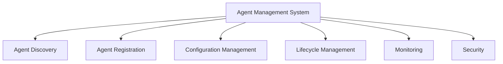

### Key Features

1. **Agent Discovery**
   - Automatic detection of new agent packages
   - Metadata extraction from .env.discovery files
   - Version compatibility checking

2. **Agent Registration**
   - Secure registration process
   - NATS credential management
   - Unique agent ID generation

3. **Configuration Management**
   - Centralized configuration storage
   - Environment-based overrides
   - Runtime configuration updates

4. **Lifecycle Management**
   - Process monitoring and control
   - State management
   - Graceful shutdown handling

5. **Monitoring**
   - Health check system
   - Metric collection
   - Log aggregation
   - Alert management

6. **Security**
   - Token-based authentication
   - Role-based access control
   - TLS encryption
   - Audit logging

## 2. System Architecture

The AMS consists of several key components that work together to manage agents:

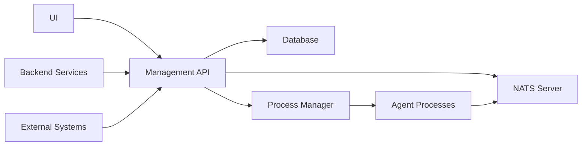

### Components

1. **Management API**
   - FastAPI-based RESTful API
   - OpenAPI documentation
   - Authentication middleware
   - Rate limiting
   - Request validation

2. **Database**
   - PostgreSQL for metadata storage
   - Redis for caching
   - Connection pooling
   - Migration management

3. **NATS Server**
   - Message broker for agent communication
   - JetStream for persistence
   - TLS encryption
   - Authentication

4. **Process Manager**
   - Process lifecycle management
   - Resource monitoring
   - Automatic restart on failure
   - Log collection

5. **UI**
   - React-based web interface
   - Real-time updates
   - Agent status dashboard
   - Configuration management

### System Interactions

1. **Backend Integration**
   - Event processing pipeline
   - Log aggregation system
   - Metric collection
   - Alert management

2. **UI Integration**
   - Real-time status updates
   - Configuration management
   - Monitoring dashboard
   - Agent control interface

3. **External System Integration**
   - Authentication providers
   - Monitoring systems
   - Log management
   - Alert notification

## 3. Agent Discovery

The discovery process allows the AMS to find and register new agents:

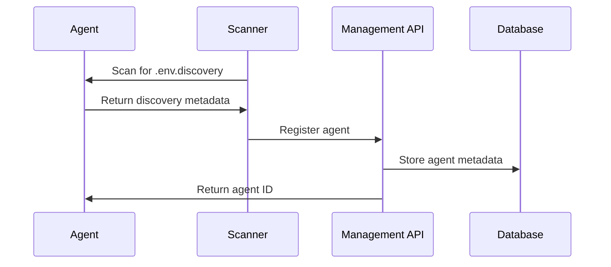

### Discovery Process

1. **Directory Scanning**
   - Monitor `backend/src/opmas/agents/` directory
   - Detect new agent packages
   - Validate package structure

2. **Metadata Extraction**
   - Read .env.discovery file
   - Parse required fields:
     ```ini
     AGENT_NAME=SecurityAgent
     AGENT_VERSION=1.0.0
     AGENT_DESCRIPTION=Security monitoring agent
     DEFAULT_SUBSCRIBED_TOPICS=logs.security,logs.auth
     DEFAULT_FINDINGS_TOPIC=findings.security
     ```

3. **Validation**
   - Check required fields
   - Validate version format
   - Verify topic names
   - Check for conflicts

4. **Registration**
   - Generate unique agent ID
   - Create database entry
   - Initialize configuration
   - Set up monitoring

### Package Structure

1. **Agent Package**
   - Contains .env.discovery file
   - Agent executable
   - Configuration files
   - Monitoring scripts

2. **Scanner**
   - Monitors agent directories
   - Detects new packages
   - Extracts metadata
   - Communicates with AMS

## 4. Agent Registration

Registration process for new agents:

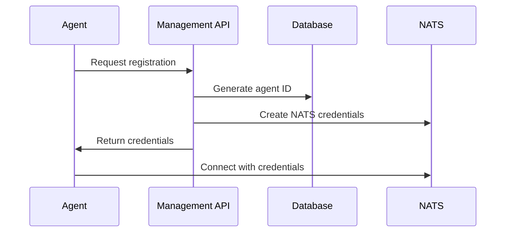

### Registration Steps

1. **Initial Request**
   ```python
   {
       "agent_name": "SecurityAgent",
       "agent_version": "1.0.0",
       "agent_type": "security",
       "discovery_token": "one-time-token"
   }
   ```

2. **ID Generation**
   - Format: `{agent_type}-{uuid}`
   - Example: `security-550e8400-e29b-41d4-a716-446655440000`

3. **NATS Credentials**
   - Generate JWT token
   - Create user account
   - Set permissions
   - Configure JetStream

4. **Configuration**
   - Set default values
   - Apply environment overrides
   - Store in database

5. **Connection**
   - Agent connects to NATS
   - Subscribes to control topic
   - Starts heartbeat
   - Reports ready status

### Authentication Flow

1. **Token-based Authentication**
   - JWT tokens
   - Short expiration
   - Refresh mechanism
   - Token revocation

2. **Role-based Access Control**
   - Admin role
   - Agent role
   - Read-only role
   - Custom roles

## 5. Configuration Management

Configuration management process:

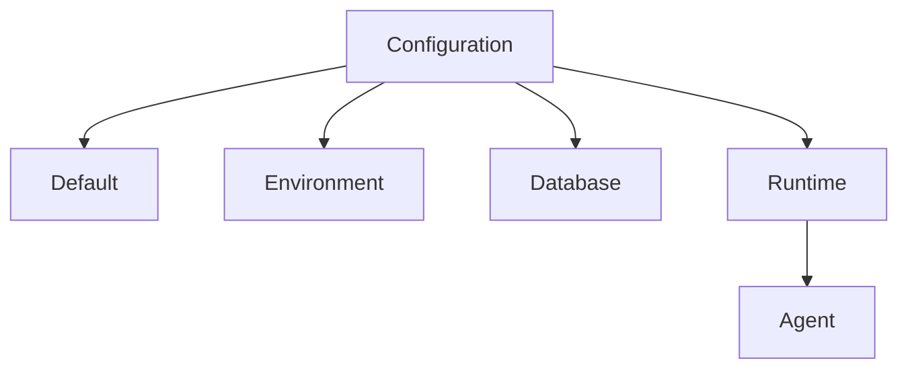

### Configuration Sources

1. **Default Configuration**
   ```python
   {
       "nats_url": "nats://localhost:4222",
       "log_level": "INFO",
       "metrics_enabled": True,
       "heartbeat_interval": 30
   }
   ```

2. **Environment Variables**
   - Prefix: `OPMAS_`
   - Example: `OPMAS_NATS_URL=nats://nats:4222`

3. **Database Settings**
   - Stored in PostgreSQL
   - Versioned configuration
   - Audit trail

4. **Runtime Updates**
   - Via NATS control messages
   - Immediate application
   - Validation before apply

### Configuration Hierarchy

1. **Agent-specific Configuration**
   - Overrides default configuration
   - Environment-specific overrides
   - Database-stored configuration

2. **Environment-specific Configuration**
   - Overrides default configuration
   - Environment-specific overrides
   - Database-stored configuration

## 6. Agent Lifecycle Management

Agent lifecycle states and transitions:

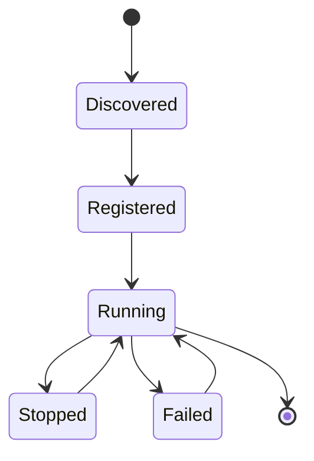

### Lifecycle States

1. **Discovered**
   - Package detected
   - Metadata extracted
   - Ready for registration

2. **Registered**
   - ID assigned
   - Credentials created
   - Configuration initialized

3. **Running**
   - Process started
   - NATS connected
   - Heartbeat active
   - Processing events

4. **Stopped**
   - Graceful shutdown
   - Resources released
   - State preserved

5. **Failed**
   - Error detected
   - Automatic restart
   - Error reporting

### State Transitions

1. **Discovered to Registered**
   - Agent package detected
   - Metadata extracted
   - Registration process initiated

2. **Registered to Running**
   - Agent registration completed
   - Configuration initialized
   - Process started

3. **Running to Stopped**
   - Process stopped
   - Resources released
   - State preserved

4. **Stopped to Running**
   - Process restarted
   - Resources reallocated
   - State restored

5. **Running to Failed**
   - Error detected
   - Process terminated
   - State marked as failed

## 7. Monitoring and Health Checks

Monitoring system architecture:

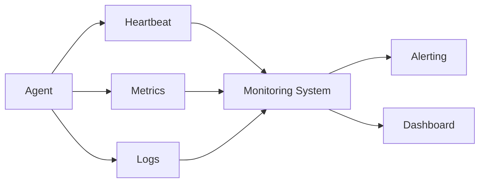

### Monitoring Components

1. **Heartbeat Monitoring**
   - Interval: 30 seconds
   - Format:
     ```json
     {
         "agent_id": "security-123",
         "status": "healthy",
         "timestamp": "2025-05-27T12:00:00Z",
         "uptime": 3600
     }
     ```

2. **Metric Collection**
   - Events processed
   - Processing time
   - Error count
   - Resource usage

3. **Log Aggregation**
   - Structured logging
   - Log levels
   - Context information
   - Error tracking

4. **Alerting System**
   - Threshold-based alerts
   - Status change notifications
   - Error rate monitoring
   - Resource alerts

5. **Dashboard**
   - Real-time status
   - Metric visualization
   - Log viewer
   - Alert history

### Metrics Collection

1. **Event Processing**
   - Total events processed
   - Successful events processed
   - Failed events processed
   - Event processing time

2. **Resource Usage**
   - CPU usage
   - Memory usage
   - Disk usage
   - Network usage

## 8. Security

Security architecture:

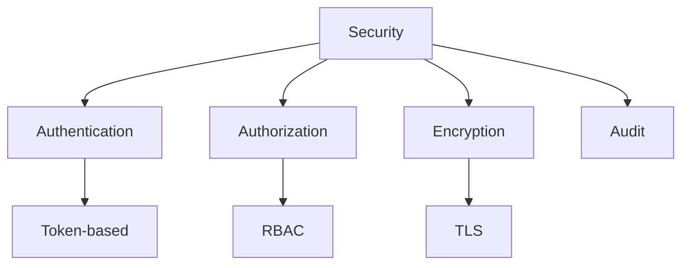

### Security Features

1. **Token-based Authentication**
   - JWT tokens
   - Short expiration
   - Refresh mechanism
   - Token revocation

2. **Role-based Access Control**
   - Admin role
   - Agent role
   - Read-only role
   - Custom roles

3. **TLS Encryption**
   - NATS TLS
   - API HTTPS
   - Certificate management
   - Key rotation

4. **Audit Logging**
   - Action tracking
   - User attribution
   - Change history
   - Security events

### Access Control

1. **Admin Access**
   - Full access to all agent management operations
   - Ability to create, update, and delete agents
   - Ability to configure agent settings

2. **Agent Access**
   - Limited access to own agent management operations
   - Ability to view agent status and configuration
   - Ability to update own agent configuration

## 9. API Design

API endpoints and methods:

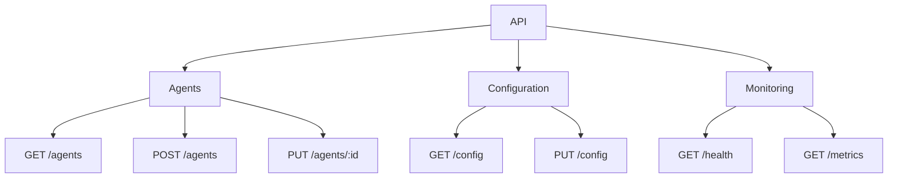

### API Endpoints

1. **Agent Management**
   ```python
   # List agents
   GET /api/v1/agents

   # Register agent
   POST /api/v1/agents

   # Update agent
   PUT /api/v1/agents/{agent_id}

   # Delete agent
   DELETE /api/v1/agents/{agent_id}
   ```

2. **Configuration**
   ```python
   # Get configuration
   GET /api/v1/agents/{agent_id}/config

   # Update configuration
   PUT /api/v1/agents/{agent_id}/config

   # Get configuration history
   GET /api/v1/agents/{agent_id}/config/history
   ```

3. **Monitoring**
   ```python
   # Get health status
   GET /api/v1/agents/{agent_id}/health

   # Get metrics
   GET /api/v1/agents/{agent_id}/metrics

   # Get logs
   GET /api/v1/agents/{agent_id}/logs
   ```

### API Versioning

1. **Versioning Strategy**
   - Major.Minor.Patch
   - Semantic versioning
   - API backward compatibility

2. **Versioning Implementation**
   - API version header
   - API version query parameter
   - API version path parameter

## 10. Database Schema

Database schema design:

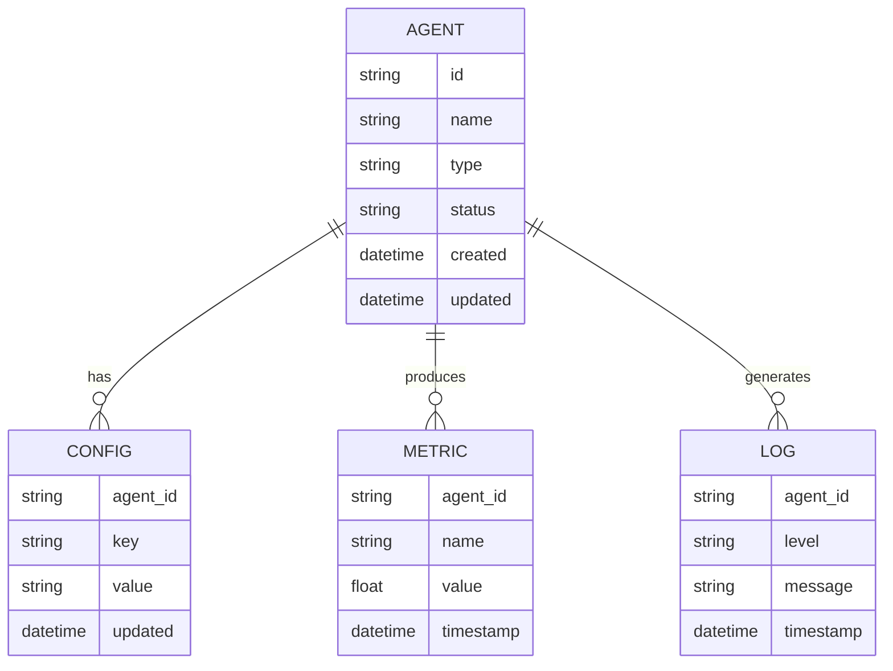

### Schema Details

1. **Agent Table**
   ```sql
   CREATE TABLE agents (
       id VARCHAR(36) PRIMARY KEY,
       name VARCHAR(255) NOT NULL,
       type VARCHAR(50) NOT NULL,
       status VARCHAR(20) NOT NULL,
       created_at TIMESTAMP NOT NULL,
       updated_at TIMESTAMP NOT NULL
   );
   ```

2. **Configuration Table**
   ```sql
   CREATE TABLE agent_configs (
       agent_id VARCHAR(36) REFERENCES agents(id),
       key VARCHAR(255) NOT NULL,
       value TEXT NOT NULL,
       updated_at TIMESTAMP NOT NULL,
       PRIMARY KEY (agent_id, key)
   );
   ```

3. **Metrics Table**
   ```sql
   CREATE TABLE agent_metrics (
       agent_id VARCHAR(36) REFERENCES agents(id),
       name VARCHAR(255) NOT NULL,
       value FLOAT NOT NULL,
       timestamp TIMESTAMP NOT NULL
   );
   ```

4. **Logs Table**
   ```sql
   CREATE TABLE agent_logs (
       agent_id VARCHAR(36) REFERENCES agents(id),
       level VARCHAR(10) NOT NULL,
       message TEXT NOT NULL,
       timestamp TIMESTAMP NOT NULL
   );
   ```

### Data Relationships

1. **One-to-Many Relationship**
   - One agent can have multiple configurations
   - One agent can have multiple metrics
   - One agent can have multiple logs

2. **Many-to-Many Relationship**
   - Multiple agents can have multiple configurations
   - Multiple agents can have multiple metrics
   - Multiple agents can have multiple logs

## 11. Error Handling

Error handling strategy:

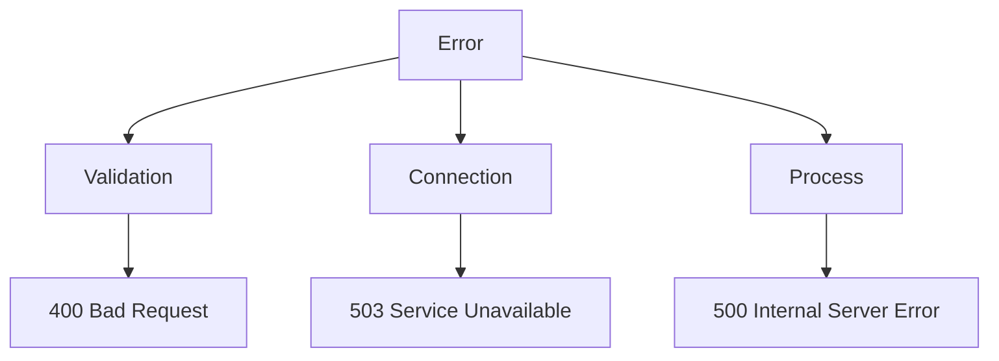

### Error Types

1. **Validation Errors**
   - Invalid configuration
   - Missing required fields
   - Type mismatches
   - Format errors

2. **Connection Errors**
   - NATS connection failure
   - Database connection issues
   - API communication problems
   - Network timeouts

3. **Process Errors**
   - Agent crashes
   - Resource exhaustion
   - Permission issues
   - System errors

### Error Recovery

1. **Automatic Restart**
   - Process restarts on failure
   - Resource reallocation
   - State restoration

2. **Manual Intervention**
   - Alert notification
   - Manual restart
   - Error reporting

## 12. Implementation Guidelines

Implementation process:

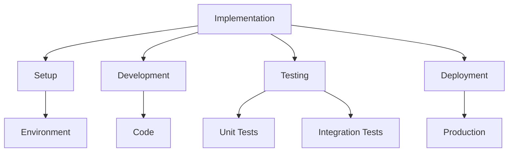

### Implementation Steps

1. **Environment Setup**
   - Development environment
   - Testing environment
   - Staging environment
   - Production environment

2. **Code Development**
   - Follow coding standards
   - Write documentation
   - Implement tests
   - Code review process

3. **Testing**
   - Unit tests
   - Integration tests
   - Performance tests
   - Security tests

4. **Deployment**
   - CI/CD pipeline
   - Version control
   - Release management
   - Monitoring setup

### Development Workflow

1. **Code Development**
   - Follow coding standards
   - Write documentation
   - Implement tests
   - Code review process

2. **Testing**
   - Unit tests
   - Integration tests
   - Performance tests
   - Security tests

3. **Deployment**
   - CI/CD pipeline
   - Version control
   - Release management
   - Monitoring setup

## 13. Integration Points

### Backend Integration

1. **Event Processing**
   ```python
   # Event flow
   Agent -> NATS -> Event Processor -> Database
   ```

2. **Log Management**
   ```python
   # Log flow
   Agent -> NATS -> Log Aggregator -> Elasticsearch
   ```

3. **Metric Collection**
   ```python
   # Metric flow
   Agent -> NATS -> Metric Collector -> Prometheus
   ```

### UI Integration

1. **Real-time Updates**
   ```typescript
   // WebSocket connection
   const ws = new WebSocket('ws://api.opmas/agents/ws');
   ws.onmessage = (event) => {
     const data = JSON.parse(event.data);
     updateAgentStatus(data);
   };
   ```

2. **Configuration Management**
   ```typescript
   // Configuration update
   async function updateAgentConfig(agentId: string, config: AgentConfig) {
     const response = await api.put(`/agents/${agentId}/config`, config);
     return response.data;
   }
   ```

3. **Monitoring Dashboard**
   ```typescript
   // Metric visualization
   const metrics = await api.get(`/agents/${agentId}/metrics`);
   renderMetricsChart(metrics.data);
   ```

## 14. Deployment

### Environment Setup

1. **Development**
   ```yaml
   # docker-compose.dev.yml
   version: '3.8'
   services:
     api:
       build: ./backend
       environment:
         - ENV=development
         - DB_URL=postgresql://user:pass@db:5432/opmas
         - NATS_URL=nats://nats:4222
     db:
       image: postgres:14
       environment:
         - POSTGRES_DB=opmas
         - POSTGRES_USER=user
         - POSTGRES_PASSWORD=pass
     nats:
       image: nats:2.9
       ports:
         - "4222:4222"
   ```

2. **Production**
   ```yaml
   # docker-compose.prod.yml
   version: '3.8'
   services:
     api:
       build: ./backend
       environment:
         - ENV=production
         - DB_URL=${DB_URL}
         - NATS_URL=${NATS_URL}
       deploy:
         replicas: 3
         restart_policy:
           condition: on-failure
     db:
       image: postgres:14
       volumes:
         - pgdata:/var/lib/postgresql/data
       deploy:
         placement:
           constraints: [node.role == manager]
     nats:
       image: nats:2.9
       volumes:
         - natsdata:/data
       deploy:
         replicas: 2
   ```

### Deployment Process

1. **Build and Test**
   ```bash
   # Build process
   docker-compose -f docker-compose.prod.yml build
   docker-compose -f docker-compose.prod.yml run --rm api pytest
   ```

2. **Deploy**
   ```bash
   # Deployment
   docker stack deploy -c docker-compose.prod.yml opmas
   ```

3. **Monitor**
   ```bash
   # Health check
   curl -f http://api.opmas/health || exit 1
   ```

4. **Rollback**
   ```bash
   # Rollback process
   docker stack deploy -c docker-compose.prod.yml.rollback opmas
   ```
