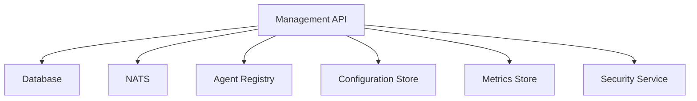
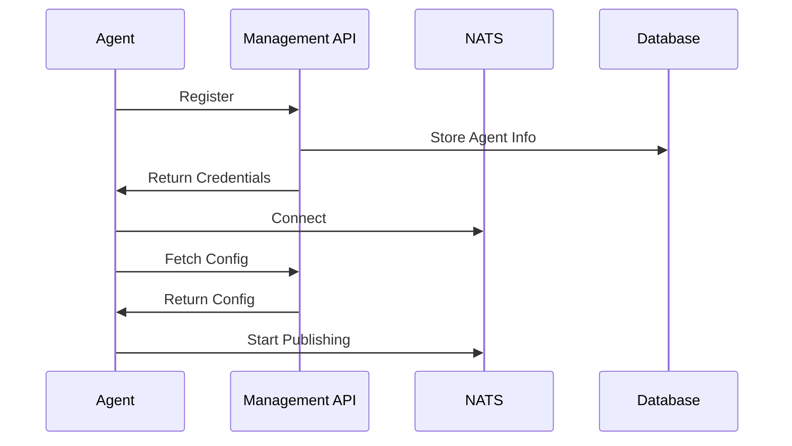

# OPMAS Agent Management System Specification

## 1. Overview

The OPMAS Agent Management System provides centralized management of all agents in the system. It handles:
- Agent discovery and registration
- Configuration management
- Health monitoring
- Metrics collection
- Resource management
- Security controls

## 2. System Architecture

### 2.1 Components


### 2.2 Data Flow


## 3. API Endpoints

### 3.1 Agent Management
```python
# Agent Registration
POST /api/v1/agents/register
{
    "agent_name": "security-agent",
    "version": "1.0.0",
    "description": "Security monitoring agent",
    "capabilities": ["log_analysis", "threat_detection"],
    "requirements": {
        "cpu": 1,
        "memory": "1GB",
        "disk": "100MB"
    }
}

# Agent Configuration
GET /api/v1/agents/{agent_id}/config
PUT /api/v1/agents/{agent_id}/config
{
    "rules": [...],
    "settings": {...},
    "limits": {...}
}

# Agent Status
GET /api/v1/agents/{agent_id}/status
{
    "status": "running",
    "health": "healthy",
    "metrics": {...},
    "resources": {...}
}
```

### 3.2 Security Management
```python
# Authentication
POST /api/v1/auth/token
{
    "agent_id": "security-agent",
    "credentials": {...}
}

# Authorization
GET /api/v1/auth/permissions/{agent_id}
{
    "permissions": ["read_logs", "write_findings"]
}
```

### 3.3 Monitoring Management
```python
# Metrics
GET /api/v1/metrics/{agent_id}
{
    "events_processed": 1000,
    "errors": 5,
    "processing_time": 0.5
}

# Health
GET /api/v1/health/{agent_id}
{
    "status": "healthy",
    "last_heartbeat": "2025-05-27T12:00:00Z",
    "resources": {...}
}
```

## 4. Database Schema

### 4.1 Agents Table
```sql
CREATE TABLE agents (
    id VARCHAR(36) PRIMARY KEY,
    name VARCHAR(255) NOT NULL,
    version VARCHAR(50) NOT NULL,
    description TEXT,
    status VARCHAR(50) NOT NULL,
    created_at TIMESTAMP NOT NULL,
    updated_at TIMESTAMP NOT NULL,
    last_heartbeat TIMESTAMP,
    config JSONB,
    capabilities JSONB,
    requirements JSONB
);
```

### 4.2 Metrics Table
```sql
CREATE TABLE metrics (
    id VARCHAR(36) PRIMARY KEY,
    agent_id VARCHAR(36) NOT NULL,
    timestamp TIMESTAMP NOT NULL,
    metrics JSONB NOT NULL,
    FOREIGN KEY (agent_id) REFERENCES agents(id)
);
```

### 4.3 Findings Table
```sql
CREATE TABLE findings (
    id VARCHAR(36) PRIMARY KEY,
    agent_id VARCHAR(36) NOT NULL,
    timestamp TIMESTAMP NOT NULL,
    type VARCHAR(50) NOT NULL,
    severity VARCHAR(50) NOT NULL,
    description TEXT,
    details JSONB,
    FOREIGN KEY (agent_id) REFERENCES agents(id)
);
```

## 5. Security Implementation

### 5.1 Authentication
```python
class Authentication:
    def __init__(self):
        self.jwt_secret = os.getenv("JWT_SECRET")
        self.token_expiry = 3600  # 1 hour

    def generate_token(self, agent_id: str) -> str:
        """Generate JWT token for agent."""
        payload = {
            "agent_id": agent_id,
            "exp": datetime.utcnow() + timedelta(seconds=self.token_expiry)
        }
        return jwt.encode(payload, self.jwt_secret, algorithm="HS256")

    def validate_token(self, token: str) -> bool:
        """Validate JWT token."""
        try:
            jwt.decode(token, self.jwt_secret, algorithms=["HS256"])
            return True
        except jwt.InvalidTokenError:
            return False
```

### 5.2 Authorization
```python
class Authorization:
    def __init__(self):
        self.permissions = {
            "security-agent": ["read_logs", "write_findings"],
            "wifi-agent": ["read_wifi", "write_findings"]
        }

    def check_permission(self, agent_id: str, action: str) -> bool:
        """Check if agent has permission for action."""
        return action in self.permissions.get(agent_id, [])
```

## 6. Monitoring Implementation

### 6.1 Health Monitoring
```python
class HealthMonitor:
    def __init__(self):
        self.heartbeat_timeout = 300  # 5 minutes

    async def check_health(self, agent_id: str) -> Dict:
        """Check agent health."""
        agent = await self.get_agent(agent_id)
        last_heartbeat = agent.get("last_heartbeat")

        if not last_heartbeat:
            return {"status": "unknown"}

        time_since_heartbeat = (
            datetime.utcnow() - last_heartbeat
        ).total_seconds()

        if time_since_heartbeat > self.heartbeat_timeout:
            return {"status": "unhealthy"}

        return {"status": "healthy"}
```

### 6.2 Metrics Collection
```python
class MetricsCollector:
    def __init__(self):
        self.metrics_store = MetricsStore()

    async def collect_metrics(self, agent_id: str, metrics: Dict):
        """Collect agent metrics."""
        await self.metrics_store.store_metrics(
            agent_id=agent_id,
            timestamp=datetime.utcnow(),
            metrics=metrics
        )

    async def get_metrics(self, agent_id: str, time_range: str) -> Dict:
        """Get agent metrics."""
        return await self.metrics_store.get_metrics(
            agent_id=agent_id,
            time_range=time_range
        )
```

## 7. Configuration Management

### 7.1 Configuration Store
```python
class ConfigurationStore:
    def __init__(self):
        self.db = Database()

    async def get_config(self, agent_id: str) -> Dict:
        """Get agent configuration."""
        agent = await self.db.get_agent(agent_id)
        return agent.get("config", {})

    async def update_config(self, agent_id: str, config: Dict):
        """Update agent configuration."""
        await self.db.update_agent(
            agent_id=agent_id,
            config=config
        )
```

### 7.2 Configuration Validation
```python
class ConfigurationValidator:
    def __init__(self):
        self.schemas = {
            "security-agent": {
                "type": "object",
                "properties": {
                    "rules": {"type": "array"},
                    "settings": {"type": "object"},
                    "limits": {"type": "object"}
                }
            }
        }

    def validate_config(self, agent_id: str, config: Dict) -> bool:
        """Validate agent configuration."""
        schema = self.schemas.get(agent_id)
        if not schema:
            return True

        try:
            jsonschema.validate(config, schema)
            return True
        except jsonschema.exceptions.ValidationError:
            return False
```

## 8. Resource Management

### 8.1 Resource Monitor
```python
class ResourceMonitor:
    def __init__(self):
        self.resource_limits = {
            "cpu": 80,  # percentage
            "memory": 80,  # percentage
            "disk": 80,  # percentage
            "network": 1024 * 1024  # 1MB/s
        }

    async def check_resources(self, agent_id: str, resources: Dict) -> Dict:
        """Check agent resource usage."""
        violations = []
        for resource, value in resources.items():
            if value > self.resource_limits.get(resource, 100):
                violations.append(resource)

        return {
            "status": "healthy" if not violations else "unhealthy",
            "violations": violations
        }
```

### 8.2 Resource Enforcement
```python
class ResourceEnforcer:
    def __init__(self):
        self.monitor = ResourceMonitor()

    async def enforce_limits(self, agent_id: str, resources: Dict):
        """Enforce resource limits."""
        status = await self.monitor.check_resources(agent_id, resources)
        if status["status"] == "unhealthy":
            await self.notify_violation(agent_id, status["violations"])
```

## 9. Error Handling

### 9.1 Error Types
```python
class ManagementError(Exception):
    """Base class for management system errors."""
    pass

class ConfigurationError(ManagementError):
    """Configuration related errors."""
    pass

class AuthenticationError(ManagementError):
    """Authentication related errors."""
    pass

class ResourceError(ManagementError):
    """Resource related errors."""
            pass
```

### 9.2 Error Handling
```python
class ErrorHandler:
    def __init__(self):
        self.logger = logging.getLogger("management")

    async def handle_error(self, error: Exception):
        """Handle management system errors."""
        self.logger.error(f"Management error: {str(error)}")

        if isinstance(error, ConfigurationError):
            await self.handle_config_error(error)
        elif isinstance(error, AuthenticationError):
            await self.handle_auth_error(error)
        elif isinstance(error, ResourceError):
            await self.handle_resource_error(error)
        else:
            await self.handle_unexpected_error(error)
```

## 10. Testing

### 10.1 Test Configuration
```python
TEST_CONFIG = {
    "test_agent": {
        "id": "test-agent",
        "name": "Test Agent",
        "version": "1.0.0",
        "config": {
            "rules": [],
            "settings": {},
            "limits": {}
        }
    }
}
```

### 10.2 Test Cases
```python
class TestManagementSystem:
    async def test_agent_registration(self):
        """Test agent registration."""
        agent = await self.register_agent(TEST_CONFIG["test_agent"])
        assert agent["id"] == TEST_CONFIG["test_agent"]["id"]

    async def test_config_management(self):
        """Test configuration management."""
        config = await self.get_config(TEST_CONFIG["test_agent"]["id"])
        assert config == TEST_CONFIG["test_agent"]["config"]

    async def test_health_monitoring(self):
        """Test health monitoring."""
        health = await self.check_health(TEST_CONFIG["test_agent"]["id"])
        assert health["status"] in ["healthy", "unhealthy"]
```

## 11. Documentation

### 11.1 API Documentation
```python
"""
# OPMAS Management API

## Authentication
POST /api/v1/auth/token
Generate authentication token for agent.

## Agent Management
POST /api/v1/agents/register
Register new agent.

GET /api/v1/agents/{agent_id}/config
Get agent configuration.

PUT /api/v1/agents/{agent_id}/config
Update agent configuration.

## Monitoring
GET /api/v1/health/{agent_id}
Get agent health status.

GET /api/v1/metrics/{agent_id}
Get agent metrics.
"""
```

### 11.2 Configuration Documentation
```python
"""
# OPMAS Management Configuration

## Environment Variables
- MANAGEMENT_API_URL: URL of the management API
- JWT_SECRET: Secret for JWT token generation
- DATABASE_URL: URL of the database
- NATS_URL: URL of the NATS server

## Security
- Token expiry: 1 hour
- Rate limiting: 100 requests per second
- Resource limits: CPU 80%, Memory 80%, Disk 80%

## Monitoring
- Heartbeat timeout: 5 minutes
- Metrics retention: 30 days
- Log retention: 90 days
"""
```

## 12. Deployment

### 12.1 Docker Configuration
```dockerfile
FROM python:3.9-slim

WORKDIR /app

COPY requirements.txt .
RUN pip install --no-cache-dir -r requirements.txt

COPY . .

CMD ["python", "-m", "management"]
```

### 12.2 Kubernetes Configuration
```yaml
apiVersion: apps/v1
kind: Deployment
metadata:
  name: opmas-management
spec:
  replicas: 3
  selector:
    matchLabels:
      app: opmas-management
  template:
    metadata:
      labels:
        app: opmas-management
    spec:
      containers:
      - name: opmas-management
        image: opmas-management:latest
        ports:
        - containerPort: 8000
        env:
        - name: MANAGEMENT_API_URL
          valueFrom:
            configMapKeyRef:
              name: opmas-config
              key: management_api_url
```

## 13. Maintenance

### 13.1 Backup Process
```bash
#!/bin/bash
# scripts/backup.sh

# Backup database
pg_dump -U postgres opmas > backup/db_$(date +%Y%m%d).sql

# Backup configurations
cp config/* backup/config_$(date +%Y%m%d)/

# Backup logs
cp logs/* backup/logs_$(date +%Y%m%d)/
```

### 13.2 Update Process
```bash
#!/bin/bash
# scripts/update.sh

# Pull latest changes
git pull origin main

# Install dependencies
pip install -r requirements.txt

# Run migrations
alembic upgrade head

# Restart service
systemctl restart opmas-management
```

## 14. Support

### 14.1 Issue Tracking
```python
class IssueTracker:
    def __init__(self):
        self.db = Database()

    async def create_issue(self, issue: Dict):
        """Create new issue."""
        await self.db.create_issue(issue)

    async def update_issue(self, issue_id: str, update: Dict):
        """Update issue."""
        await self.db.update_issue(issue_id, update)

    async def get_issue(self, issue_id: str) -> Dict:
        """Get issue details."""
        return await self.db.get_issue(issue_id)
```

### 14.2 Support Process
```python
class SupportProcess:
    def __init__(self):
        self.tracker = IssueTracker()
        self.logger = logging.getLogger("support")

    async def handle_support_request(self, request: Dict):
        """Handle support request."""
        self.logger.info(f"Support request: {request}")

        # Create issue
        issue = await self.tracker.create_issue(request)

        # Notify support team
        await self.notify_support_team(issue)

        # Track resolution
        await self.track_resolution(issue)
```
