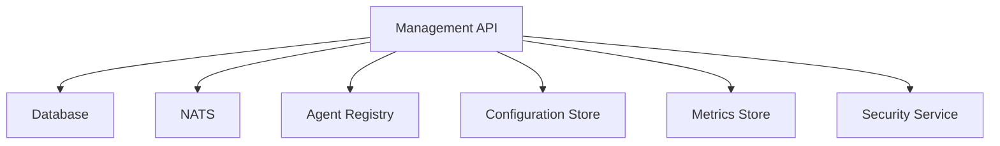
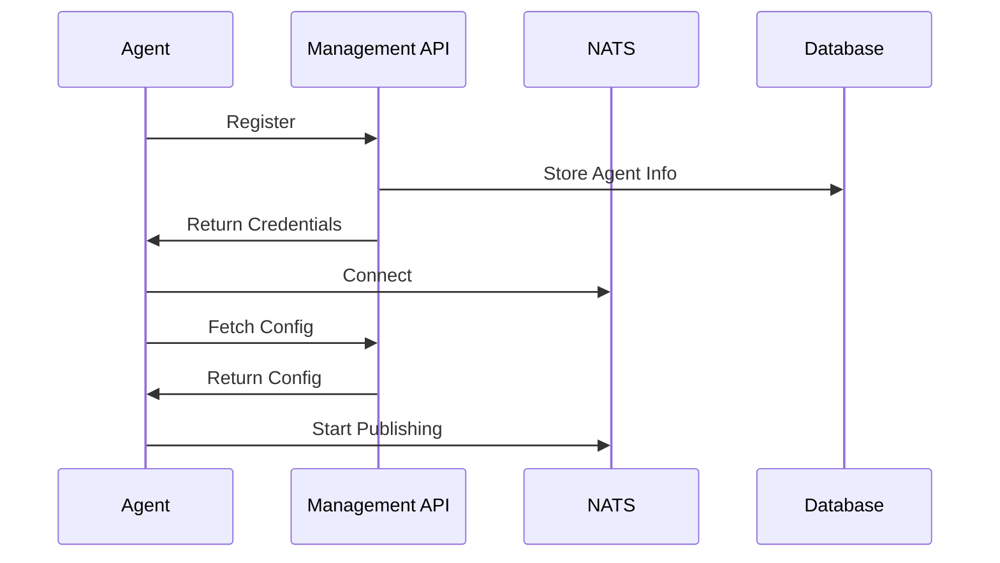

# OPMAS Agent Management System Specification

## 1. Overview

The OPMAS Agent Management System provides centralized management of all agents in the system. It handles:
- Agent discovery and registration
- Configuration management
- Health monitoring
- Metrics collection
- Resource management
- Security controls

## 2. System Architecture

### 2.1 Components


### 2.2 Data Flow


## 3. Implementation Status

### 3.1 Completed Features
- Basic agent model implementation
- Agent discovery and registration
- Basic configuration management
- Health monitoring with heartbeat
- NATS integration
- Basic security validation

### 3.2 Pending Features
- JWT-based authentication
- Permission-based authorization
- Resource monitoring and limits
- Advanced metrics collection
- Configuration version control
- Configuration validation and rollback

## 4. API Endpoints

### 4.1 Agent Management
```python
# Agent Registration (Implemented)
POST /api/v1/agents/register
{
    "name": "security-agent",
    "agent_type": "security",
    "hostname": "agent-host",
    "ip_address": "192.168.1.100",
    "port": 8080,
    "status": "online",
    "enabled": true,
    "agent_metadata": {
        "version": "1.0.0",
        "capabilities": ["log_analysis", "threat_detection"]
    }
}

# Agent Configuration (Basic Implementation)
GET /api/v1/agents/{agent_id}/config
PUT /api/v1/agents/{agent_id}/config
{
    "rules": [...],
    "settings": {...},
    "limits": {...}
}

# Agent Status (Implemented)
GET /api/v1/agents/{agent_id}/status
{
    "status": "online",
    "last_heartbeat": "2024-03-27T12:00:00Z",
    "enabled": true
}
```

### 4.2 Security Management (To Be Implemented)
```python
# Authentication
POST /api/v1/auth/token
{
    "agent_id": "security-agent",
    "credentials": {...}
}

# Authorization
GET /api/v1/auth/permissions/{agent_id}
{
    "permissions": ["read_logs", "write_findings"]
}
```

### 4.3 Monitoring Management (Basic Implementation)
```python
# Metrics
GET /api/v1/metrics/{agent_id}
{
    "status": "online",
    "last_heartbeat": "2024-03-27T12:00:00Z"
}

# Health
GET /api/v1/health/{agent_id}
{
    "status": "healthy",
    "last_heartbeat": "2024-03-27T12:00:00Z"
}
```

## 5. Database Schema

### 5.1 Agents Table (Implemented)
```sql
CREATE TABLE agents (
    id UUID PRIMARY KEY,
    name VARCHAR(255) NOT NULL,
    agent_type VARCHAR(50) NOT NULL,
    hostname VARCHAR(255),
    ip_address INET,
    port INTEGER,
    status VARCHAR(50) NOT NULL,
    enabled BOOLEAN DEFAULT true,
    created_at TIMESTAMP NOT NULL,
    updated_at TIMESTAMP NOT NULL,
    last_heartbeat TIMESTAMP,
    agent_metadata JSONB,
    config JSONB
);
```

### 5.2 Metrics Table (To Be Implemented)
```sql
CREATE TABLE metrics (
    id UUID PRIMARY KEY,
    agent_id UUID NOT NULL,
    timestamp TIMESTAMP NOT NULL,
    metrics JSONB NOT NULL,
    FOREIGN KEY (agent_id) REFERENCES agents(id)
);
```

### 5.3 Findings Table (To Be Implemented)
```sql
CREATE TABLE findings (
    id UUID PRIMARY KEY,
    agent_id UUID NOT NULL,
    timestamp TIMESTAMP NOT NULL,
    type VARCHAR(50) NOT NULL,
    severity VARCHAR(50) NOT NULL,
    description TEXT,
    details JSONB,
    FOREIGN KEY (agent_id) REFERENCES agents(id)
);
```

## 6. Next Steps

### 6.1 Priority 1: Security Implementation
- Implement JWT-based authentication
- Add permission-based authorization
- Implement role-based access control
- Add security audit logging

### 6.2 Priority 2: Resource Management
- Implement resource monitoring
- Add resource limits and enforcement
- Implement resource usage tracking
- Add resource allocation optimization

### 6.3 Priority 3: Metrics and Monitoring
- Implement structured metrics storage
- Add metrics aggregation
- Implement historical metrics analysis
- Add performance monitoring

### 6.4 Priority 4: Configuration Management
- Implement configuration version control
- Add configuration validation
- Implement configuration rollback
- Add configuration templates

## 7. Testing Requirements

### 7.1 Unit Tests
- Agent registration and validation
- Configuration management
- Health monitoring
- Security implementation

### 7.2 Integration Tests
- Agent lifecycle management
- NATS communication
- Database operations
- API endpoints

### 7.3 Performance Tests
- Agent registration throughput
- Configuration update latency
- Metrics collection performance
- Resource monitoring overhead

## 8. Documentation Requirements

### 8.1 API Documentation
- Complete API endpoint documentation
- Request/response examples
- Error handling documentation
- Authentication/authorization guide

### 8.2 Implementation Guide
- Agent development guide
- Configuration management guide
- Security implementation guide
- Monitoring setup guide

### 8.3 Operations Guide
- Deployment guide
- Maintenance procedures
- Troubleshooting guide
- Security best practices
