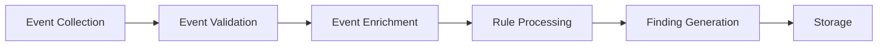

# OPMAS Event Processing Specification

## 1. Overview

The OPMAS Event Processing system is responsible for:
- Collecting security events from agents
- Processing events through analysis rules
- Generating security findings
- Storing events and findings
- Providing event querying capabilities

## 2. Event Model

### 2.1 Event Structure
```python
class Event:
    """Security event model."""

    def __init__(self, event_id: str, agent_id: str, event_type: str, data: Dict):
        self.id = event_id
        self.agent_id = agent_id
        self.type = event_type
        self.data = data
        self.timestamp = datetime.utcnow()

    def to_dict(self) -> Dict:
        """Convert event to dictionary."""
        return {
            "id": self.id,
            "agent_id": self.agent_id,
            "type": self.type,
            "data": self.data,
            "timestamp": self.timestamp.isoformat()
        }

    @classmethod
    def from_dict(cls, data: Dict) -> 'Event':
        """Create event from dictionary."""
        return cls(
            event_id=data["id"],
            agent_id=data["agent_id"],
            event_type=data["type"],
            data=data["data"]
        )
```

### 2.2 Event Types
```python
EVENT_TYPES = {
    "LOG": "Log event from system or application",
    "NETWORK": "Network traffic or connection event",
    "AUTH": "Authentication or authorization event",
    "FILE": "File system event",
    "PROCESS": "Process execution event",
    "REGISTRY": "Registry modification event",
    "CUSTOM": "Custom event type"
}
```

## 3. Event Processing Pipeline

### 3.1 Pipeline Stages


### 3.2 Pipeline Implementation
```python
class EventPipeline:
    """Event processing pipeline."""

    def __init__(self, db: Database, rules: List[Rule]):
        self.db = db
        self.rules = rules
        self.metrics = Metrics()

    async def process_event(self, event: Event) -> List[Finding]:
        """Process event through pipeline."""
        # Validate event
        if not self._validate_event(event):
            raise ValidationError("Invalid event")

        # Enrich event
        enriched_event = await self._enrich_event(event)

        # Process rules
        findings = []
        for rule in self.rules:
            if await rule.matches(enriched_event):
                finding = await rule.generate_finding(enriched_event)
                findings.append(finding)

        # Store event and findings
        await self._store_results(enriched_event, findings)

        return findings
```

## 4. Rule Processing

### 4.1 Rule Model
```python
class Rule:
    """Analysis rule model."""

    def __init__(self, rule_id: str, name: str, description: str, conditions: List[Dict]):
        self.id = rule_id
        self.name = name
        self.description = description
        self.conditions = conditions

    async def matches(self, event: Event) -> bool:
        """Check if event matches rule conditions."""
        for condition in self.conditions:
            if not await self._evaluate_condition(event, condition):
                return False
        return True

    async def generate_finding(self, event: Event) -> Finding:
        """Generate finding from matching event."""
        return Finding(
            finding_id=str(uuid.uuid4()),
            event_id=event.id,
            rule_id=self.id,
            severity=self._determine_severity(event),
            description=self._generate_description(event),
            details=self._extract_details(event)
        )
```

### 4.2 Rule Types
```python
RULE_TYPES = {
    "THRESHOLD": "Threshold-based rule",
    "PATTERN": "Pattern matching rule",
    "CORRELATION": "Event correlation rule",
    "STATISTICAL": "Statistical analysis rule",
    "MACHINE_LEARNING": "Machine learning based rule"
}
```

## 5. Finding Generation

### 5.1 Finding Model
```python
class Finding:
    """Security finding model."""

    def __init__(self, finding_id: str, event_id: str, rule_id: str,
                 severity: str, description: str, details: Dict):
        self.id = finding_id
        self.event_id = event_id
        self.rule_id = rule_id
        self.severity = severity
        self.description = description
        self.details = details
        self.timestamp = datetime.utcnow()

    def to_dict(self) -> Dict:
        """Convert finding to dictionary."""
        return {
            "id": self.id,
            "event_id": self.event_id,
            "rule_id": self.rule_id,
            "severity": self.severity,
            "description": self.description,
            "details": self.details,
            "timestamp": self.timestamp.isoformat()
        }
```

### 5.2 Severity Levels
```python
SEVERITY_LEVELS = {
    "CRITICAL": "Critical security issue",
    "HIGH": "High severity issue",
    "MEDIUM": "Medium severity issue",
    "LOW": "Low severity issue",
    "INFO": "Informational finding"
}
```

## 6. Event Storage

### 6.1 Storage Model
```python
class EventStorage:
    """Event storage service."""

    def __init__(self, db: Database):
        self.db = db

    async def store_event(self, event: Event):
        """Store event in database."""
        await self.db.execute(
            """
            INSERT INTO events (id, agent_id, type, data, timestamp)
            VALUES ($1, $2, $3, $4, $5)
            """,
            event.id, event.agent_id, event.type,
            json.dumps(event.data), event.timestamp
        )

    async def store_finding(self, finding: Finding):
        """Store finding in database."""
        await self.db.execute(
            """
            INSERT INTO findings (id, event_id, rule_id, severity,
                                description, details, timestamp)
            VALUES ($1, $2, $3, $4, $5, $6, $7)
            """,
            finding.id, finding.event_id, finding.rule_id,
            finding.severity, finding.description,
            json.dumps(finding.details), finding.timestamp
        )
```

### 6.2 Query Interface
```python
class EventQuery:
    """Event query service."""

    def __init__(self, db: Database):
        self.db = db

    async def get_event(self, event_id: str) -> Event:
        """Get event by ID."""
        row = await self.db.fetchrow(
            "SELECT * FROM events WHERE id = $1",
            event_id
        )
        return Event.from_dict(row)

    async def get_events(self, filters: Dict) -> List[Event]:
        """Get events matching filters."""
        query = "SELECT * FROM events WHERE 1=1"
        params = []

        if "agent_id" in filters:
            query += " AND agent_id = $" + str(len(params) + 1)
            params.append(filters["agent_id"])

        if "type" in filters:
            query += " AND type = $" + str(len(params) + 1)
            params.append(filters["type"])

        if "start_time" in filters:
            query += " AND timestamp >= $" + str(len(params) + 1)
            params.append(filters["start_time"])

        if "end_time" in filters:
            query += " AND timestamp <= $" + str(len(params) + 1)
            params.append(filters["end_time"])

        rows = await self.db.fetch(query, *params)
        return [Event.from_dict(row) for row in rows]
```

## 7. Event Enrichment

### 7.1 Enrichment Model
```python
class EventEnricher:
    """Event enrichment service."""

    def __init__(self, db: Database):
        self.db = db

    async def enrich_event(self, event: Event) -> Event:
        """Enrich event with additional data."""
        # Add agent information
        agent = await self.db.get_agent(event.agent_id)
        event.data["agent"] = agent

        # Add context information
        context = await self._get_context(event)
        event.data["context"] = context

        # Add threat intelligence
        threats = await self._get_threat_intelligence(event)
        event.data["threats"] = threats

        return event
```

### 7.2 Enrichment Sources
```python
ENRICHMENT_SOURCES = {
    "AGENT_INFO": "Agent metadata and capabilities",
    "CONTEXT": "Event context and related events",
    "THREAT_INTEL": "Threat intelligence data",
    "GEO_LOCATION": "Geographic location data",
    "ASSET_INFO": "Asset information and classification"
}
```

## 8. Performance Optimization

### 8.1 Caching
```python
class EventCache:
    """Event caching service."""

    def __init__(self, redis_url: str):
        self.redis = aioredis.from_url(redis_url)

    async def get_event(self, event_id: str) -> Optional[Event]:
        """Get event from cache."""
        data = await self.redis.get(f"event:{event_id}")
        if data:
            return Event.from_dict(json.loads(data))
        return None

    async def set_event(self, event: Event, ttl: int = 3600):
        """Cache event with TTL."""
        await self.redis.set(
            f"event:{event.id}",
            json.dumps(event.to_dict()),
            ex=ttl
        )
```

### 8.2 Batch Processing
```python
class BatchProcessor:
    """Batch event processor."""

    def __init__(self, pipeline: EventPipeline, batch_size: int = 100):
        self.pipeline = pipeline
        self.batch_size = batch_size
        self.batch = []

    async def process_event(self, event: Event):
        """Process event in batch."""
        self.batch.append(event)

        if len(self.batch) >= self.batch_size:
            await self._process_batch()

    async def _process_batch(self):
        """Process batch of events."""
        if not self.batch:
            return

        # Process events in parallel
        tasks = [
            self.pipeline.process_event(event)
            for event in self.batch
        ]
        await asyncio.gather(*tasks)

        self.batch = []
```

## 9. Error Handling

### 9.1 Error Types
```python
class EventProcessingError(Exception):
    """Base class for event processing errors."""
    pass

class ValidationError(EventProcessingError):
    """Event validation error."""
    pass

class EnrichmentError(EventProcessingError):
    """Event enrichment error."""
    pass

class RuleError(EventProcessingError):
    """Rule processing error."""
    pass

class StorageError(EventProcessingError):
    """Event storage error."""
    pass
```

### 9.2 Error Handling
```python
class ErrorHandler:
    """Error handling service."""

    def __init__(self, logger: Logger):
        self.logger = logger

    async def handle_error(self, error: Exception, event: Event):
        """Handle event processing error."""
        self.logger.error(
            f"Error processing event {event.id}: {str(error)}",
            extra={"event": event.to_dict(), "error": str(error)}
        )

        if isinstance(error, ValidationError):
            await self._handle_validation_error(error, event)
        elif isinstance(error, EnrichmentError):
            await self._handle_enrichment_error(error, event)
        elif isinstance(error, RuleError):
            await self._handle_rule_error(error, event)
        elif isinstance(error, StorageError):
            await self._handle_storage_error(error, event)
        else:
            await self._handle_unexpected_error(error, event)
```

## 10. Testing

### 10.1 Unit Tests
```python
class TestEventProcessing:
    """Unit tests for event processing."""

    def test_event_validation(self):
        """Test event validation."""
        event = Event(
            event_id="test",
            agent_id="test-agent",
            event_type="TEST",
            data={}
        )
        assert self.pipeline._validate_event(event)

    def test_rule_matching(self):
        """Test rule matching."""
        event = Event(
            event_id="test",
            agent_id="test-agent",
            event_type="TEST",
            data={"value": 100}
        )
        rule = Rule(
            rule_id="test-rule",
            name="Test Rule",
            description="Test rule description",
            conditions=[{"field": "value", "operator": ">", "value": 50}]
        )
        assert rule.matches(event)
```

### 10.2 Integration Tests
```python
class TestEventPipeline:
    """Integration tests for event pipeline."""

    async def test_event_processing(self):
        """Test event processing pipeline."""
        # Create test event
        event = Event(
            event_id="test",
            agent_id="test-agent",
            event_type="TEST",
            data={"value": 100}
        )

        # Process event
        findings = await self.pipeline.process_event(event)

        # Verify results
        assert len(findings) > 0
        assert findings[0].severity == "HIGH"
```

## 11. Monitoring

### 11.1 Metrics
```python
class EventMetrics:
    """Event processing metrics."""

    def __init__(self):
        self.events_processed = Counter()
        self.events_validated = Counter()
        self.events_enriched = Counter()
        self.rules_processed = Counter()
        self.findings_generated = Counter()
        self.processing_time = Histogram()

    def record_event_processed(self):
        """Record processed event."""
        self.events_processed.inc()

    def record_event_validated(self):
        """Record validated event."""
        self.events_validated.inc()

    def record_event_enriched(self):
        """Record enriched event."""
        self.events_enriched.inc()

    def record_rule_processed(self):
        """Record processed rule."""
        self.rules_processed.inc()

    def record_finding_generated(self):
        """Record generated finding."""
        self.findings_generated.inc()

    def record_processing_time(self, duration: float):
        """Record processing time."""
        self.processing_time.observe(duration)
```

### 11.2 Health Checks
```python
class HealthCheck:
    """Health check service."""

    def __init__(self, db: Database, redis: Redis):
        self.db = db
        self.redis = redis

    async def check_health(self) -> Dict:
        """Check system health."""
        return {
            "status": "healthy",
            "components": {
                "database": await self._check_database(),
                "cache": await self._check_cache(),
                "pipeline": await self._check_pipeline()
            }
        }

    async def _check_database(self) -> Dict:
        """Check database health."""
        try:
            await self.db.execute("SELECT 1")
            return {"status": "healthy"}
        except Exception as e:
            return {"status": "unhealthy", "error": str(e)}
```

## 12. Documentation

### 12.1 API Documentation
```python
"""
# Event Processing API

## Event Submission
POST /api/v1/events
Submit new security event.

## Event Query
GET /api/v1/events/{event_id}
Get event by ID.

GET /api/v1/events
Query events with filters.

## Finding Query
GET /api/v1/findings
Query findings with filters.
"""
```

### 12.2 Configuration Documentation
```python
"""
# Event Processing Configuration

## Pipeline
- Batch size: 100 events
- Processing timeout: 30 seconds
- Max retries: 3

## Storage
- Event retention: 90 days
- Finding retention: 365 days
- Cache TTL: 1 hour

## Performance
- Max concurrent processing: 1000
- Max batch size: 1000
- Cache size: 10000 events
"""
```

## 13. Maintenance

### 13.1 Cleanup Process
```python
class CleanupProcess:
    """Data cleanup process."""

    def __init__(self, db: Database):
        self.db = db

    async def cleanup_old_events(self, days: int = 90):
        """Clean up old events."""
        await self.db.execute(
            """
            DELETE FROM events
            WHERE timestamp < NOW() - INTERVAL '$1 days'
            """,
            days
        )

    async def cleanup_old_findings(self, days: int = 365):
        """Clean up old findings."""
        await self.db.execute(
            """
            DELETE FROM findings
            WHERE timestamp < NOW() - INTERVAL '$1 days'
            """,
            days
        )
```

### 13.2 Maintenance Tasks
```python
class MaintenanceTasks:
    """Maintenance tasks."""

    def __init__(self, db: Database, redis: Redis):
        self.db = db
        self.redis = redis

    async def run_maintenance(self):
        """Run maintenance tasks."""
        # Clean up old data
        await self.cleanup_old_events()
        await self.cleanup_old_findings()

        # Vacuum database
        await self.db.execute("VACUUM ANALYZE")

        # Clear old cache entries
        await self.redis.flushdb()
```

## 14. Support

### 14.1 Debugging
```python
class Debugger:
    """Event processing debugger."""

    def __init__(self, logger: Logger):
        self.logger = logger

    async def debug_event(self, event: Event):
        """Debug event processing."""
        self.logger.debug(
            f"Processing event {event.id}",
            extra={
                "event": event.to_dict(),
                "pipeline_stage": "start"
            }
        )

        # Process event with debug logging
        try:
            findings = await self.pipeline.process_event(event)
            self.logger.debug(
                f"Event {event.id} processed successfully",
                extra={
                    "event": event.to_dict(),
                    "findings": [f.to_dict() for f in findings],
                    "pipeline_stage": "end"
                }
            )
        except Exception as e:
            self.logger.error(
                f"Error processing event {event.id}",
                extra={
                    "event": event.to_dict(),
                    "error": str(e),
                    "pipeline_stage": "error"
                }
            )
```

### 14.2 Troubleshooting
```python
class Troubleshooter:
    """Event processing troubleshooter."""

    def __init__(self, db: Database, logger: Logger):
        self.db = db
        self.logger = logger

    async def troubleshoot_event(self, event_id: str) -> Dict:
        """Troubleshoot event processing."""
        # Get event details
        event = await self.db.get_event(event_id)
        if not event:
            return {"status": "error", "message": "Event not found"}

        # Get processing history
        history = await self.db.get_processing_history(event_id)

        # Get related findings
        findings = await self.db.get_event_findings(event_id)

        return {
            "status": "success",
            "event": event.to_dict(),
            "history": history,
            "findings": [f.to_dict() for f in findings]
        }
```
