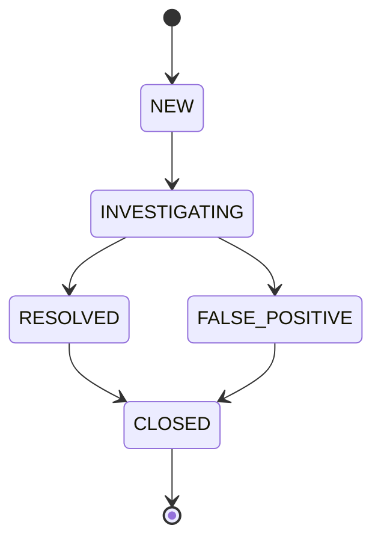

# OPMAS Findings Specification

## 1. Overview

The OPMAS Findings system is responsible for:
- Managing security findings generated from events
- Providing finding aggregation and correlation
- Supporting finding investigation and response
- Maintaining finding lifecycle and status
- Enabling finding reporting and export

## 2. Finding Model

### 2.1 Finding Structure
```python
class Finding:
    """Security finding model."""

    def __init__(self, finding_id: str, event_id: str, rule_id: str,
                 severity: str, description: str, details: Dict):
        self.id = finding_id
        self.event_id = event_id
        self.rule_id = rule_id
        self.severity = severity
        self.description = description
        self.details = details
        self.status = "NEW"
        self.timestamp = datetime.utcnow()
        self.updated_at = datetime.utcnow()

    def to_dict(self) -> Dict:
        """Convert finding to dictionary."""
        return {
            "id": self.id,
            "event_id": self.event_id,
            "rule_id": self.rule_id,
            "severity": self.severity,
            "description": self.description,
            "details": self.details,
            "status": self.status,
            "timestamp": self.timestamp.isoformat(),
            "updated_at": self.updated_at.isoformat()
        }

    @classmethod
    def from_dict(cls, data: Dict) -> 'Finding':
        """Create finding from dictionary."""
        finding = cls(
            finding_id=data["id"],
            event_id=data["event_id"],
            rule_id=data["rule_id"],
            severity=data["severity"],
            description=data["description"],
            details=data["details"]
        )
        finding.status = data["status"]
        finding.timestamp = datetime.fromisoformat(data["timestamp"])
        finding.updated_at = datetime.fromisoformat(data["updated_at"])
        return finding
```

### 2.2 Finding Types
```python
FINDING_TYPES = {
    "THREAT": "Security threat detection",
    "VULNERABILITY": "System vulnerability",
    "COMPLIANCE": "Compliance violation",
    "ANOMALY": "Anomalous behavior",
    "INCIDENT": "Security incident",
    "CUSTOM": "Custom finding type"
}
```

## 3. Finding Management

### 3.1 Finding Lifecycle


### 3.2 Finding Management Implementation
```python
class FindingManager:
    """Finding management service."""

    def __init__(self, db: Database):
        self.db = db

    async def create_finding(self, finding: Finding):
        """Create new finding."""
        await self.db.execute(
            """
            INSERT INTO findings (id, event_id, rule_id, severity,
                                description, details, status, timestamp)
            VALUES ($1, $2, $3, $4, $5, $6, $7, $8)
            """,
            finding.id, finding.event_id, finding.rule_id,
            finding.severity, finding.description,
            json.dumps(finding.details), finding.status,
            finding.timestamp
        )

    async def update_finding(self, finding_id: str, update: Dict):
        """Update finding."""
        await self.db.execute(
            """
            UPDATE findings
            SET status = $1, details = $2, updated_at = $3
            WHERE id = $4
            """,
            update["status"],
            json.dumps(update["details"]),
            datetime.utcnow(),
            finding_id
        )
```

## 4. Finding Aggregation

### 4.1 Aggregation Model
```python
class FindingAggregator:
    """Finding aggregation service."""

    def __init__(self, db: Database):
        self.db = db

    async def aggregate_findings(self, criteria: Dict) -> List[Finding]:
        """Aggregate findings based on criteria."""
        query = """
            SELECT * FROM findings
            WHERE 1=1
        """
        params = []

        if "severity" in criteria:
            query += " AND severity = $" + str(len(params) + 1)
            params.append(criteria["severity"])

        if "status" in criteria:
            query += " AND status = $" + str(len(params) + 1)
            params.append(criteria["status"])

        if "time_range" in criteria:
            query += " AND timestamp BETWEEN $" + str(len(params) + 1)
            query += " AND $" + str(len(params) + 2)
            params.extend(criteria["time_range"])

        rows = await self.db.fetch(query, *params)
        return [Finding.from_dict(row) for row in rows]
```

### 4.2 Correlation Model
```python
class FindingCorrelator:
    """Finding correlation service."""

    def __init__(self, db: Database):
        self.db = db

    async def correlate_findings(self, finding: Finding) -> List[Finding]:
        """Find correlated findings."""
        # Get related events
        events = await self.db.get_related_events(finding.event_id)

        # Get findings from related events
        related_findings = []
        for event in events:
            findings = await self.db.get_event_findings(event.id)
            related_findings.extend(findings)

        return related_findings
```

## 5. Finding Investigation

### 5.1 Investigation Model
```python
class FindingInvestigator:
    """Finding investigation service."""

    def __init__(self, db: Database):
        self.db = db

    async def investigate_finding(self, finding_id: str) -> Dict:
        """Investigate finding."""
        # Get finding details
        finding = await self.db.get_finding(finding_id)

        # Get related events
        events = await self.db.get_related_events(finding.event_id)

        # Get related findings
        findings = await self.db.get_related_findings(finding_id)

        # Get context information
        context = await self.db.get_finding_context(finding_id)

        return {
            "finding": finding.to_dict(),
            "events": [e.to_dict() for e in events],
            "related_findings": [f.to_dict() for f in findings],
            "context": context
        }
```

### 5.2 Response Model
```python
class FindingResponder:
    """Finding response service."""

    def __init__(self, db: Database):
        self.db = db

    async def respond_to_finding(self, finding_id: str, response: Dict):
        """Respond to finding."""
        # Update finding status
        await self.db.update_finding_status(
            finding_id,
            response["status"]
        )

        # Record response
        await self.db.record_finding_response(
            finding_id,
            response["action"],
            response["details"]
        )

        # Trigger automated response if configured
        if response.get("automated"):
            await self._trigger_automated_response(finding_id, response)
```

## 6. Finding Storage

### 6.1 Storage Model
```python
class FindingStorage:
    """Finding storage service."""

    def __init__(self, db: Database):
        self.db = db

    async def store_finding(self, finding: Finding):
        """Store finding in database."""
        await self.db.execute(
            """
            INSERT INTO findings (id, event_id, rule_id, severity,
                                description, details, status, timestamp)
            VALUES ($1, $2, $3, $4, $5, $6, $7, $8)
            """,
            finding.id, finding.event_id, finding.rule_id,
            finding.severity, finding.description,
            json.dumps(finding.details), finding.status,
            finding.timestamp
        )

    async def get_finding(self, finding_id: str) -> Finding:
        """Get finding by ID."""
        row = await self.db.fetchrow(
            "SELECT * FROM findings WHERE id = $1",
            finding_id
        )
        return Finding.from_dict(row)
```

### 6.2 Query Interface
```python
class FindingQuery:
    """Finding query service."""

    def __init__(self, db: Database):
        self.db = db

    async def get_findings(self, filters: Dict) -> List[Finding]:
        """Get findings matching filters."""
        query = "SELECT * FROM findings WHERE 1=1"
        params = []

        if "severity" in filters:
            query += " AND severity = $" + str(len(params) + 1)
            params.append(filters["severity"])

        if "status" in filters:
            query += " AND status = $" + str(len(params) + 1)
            params.append(filters["status"])

        if "start_time" in filters:
            query += " AND timestamp >= $" + str(len(params) + 1)
            params.append(filters["start_time"])

        if "end_time" in filters:
            query += " AND timestamp <= $" + str(len(params) + 1)
            params.append(filters["end_time"])

        rows = await self.db.fetch(query, *params)
        return [Finding.from_dict(row) for row in rows]
```

## 7. Finding Reporting

### 7.1 Report Generation
```python
class FindingReporter:
    """Finding report generator."""

    def __init__(self, db: Database):
        self.db = db

    async def generate_report(self, criteria: Dict) -> Dict:
        """Generate finding report."""
        # Get findings
        findings = await self.db.get_findings(criteria)

        # Generate statistics
        stats = self._generate_statistics(findings)

        # Generate trends
        trends = self._generate_trends(findings)

        # Generate recommendations
        recommendations = self._generate_recommendations(findings)

        return {
            "findings": [f.to_dict() for f in findings],
            "statistics": stats,
            "trends": trends,
            "recommendations": recommendations
        }
```

### 7.2 Export Formats
```python
class FindingExporter:
    """Finding exporter."""

    def __init__(self, db: Database):
        self.db = db

    async def export_findings(self, findings: List[Finding], format: str) -> bytes:
        """Export findings in specified format."""
        if format == "json":
            return self._export_json(findings)
        elif format == "csv":
            return self._export_csv(findings)
        elif format == "pdf":
            return await self._export_pdf(findings)
        else:
            raise ValueError(f"Unsupported format: {format}")

    def _export_json(self, findings: List[Finding]) -> bytes:
        """Export findings as JSON."""
        return json.dumps(
            [f.to_dict() for f in findings],
            indent=2
        ).encode()

    def _export_csv(self, findings: List[Finding]) -> bytes:
        """Export findings as CSV."""
        output = io.StringIO()
        writer = csv.DictWriter(output, fieldnames=[
            "id", "severity", "description", "status",
            "timestamp", "updated_at"
        ])
        writer.writeheader()
        writer.writerows(f.to_dict() for f in findings)
        return output.getvalue().encode()
```

## 8. Performance Optimization

### 8.1 Caching
```python
class FindingCache:
    """Finding cache service."""

    def __init__(self, redis_url: str):
        self.redis = aioredis.from_url(redis_url)

    async def get_finding(self, finding_id: str) -> Optional[Finding]:
        """Get finding from cache."""
        data = await self.redis.get(f"finding:{finding_id}")
        if data:
            return Finding.from_dict(json.loads(data))
        return None

    async def set_finding(self, finding: Finding, ttl: int = 3600):
        """Cache finding with TTL."""
        await self.redis.set(
            f"finding:{finding.id}",
            json.dumps(finding.to_dict()),
            ex=ttl
        )
```

### 8.2 Batch Processing
```python
class BatchProcessor:
    """Batch finding processor."""

    def __init__(self, manager: FindingManager, batch_size: int = 100):
        self.manager = manager
        self.batch_size = batch_size
        self.batch = []

    async def process_finding(self, finding: Finding):
        """Process finding in batch."""
        self.batch.append(finding)

        if len(self.batch) >= self.batch_size:
            await self._process_batch()

    async def _process_batch(self):
        """Process batch of findings."""
        if not self.batch:
            return

        # Process findings in parallel
        tasks = [
            self.manager.create_finding(finding)
            for finding in self.batch
        ]
        await asyncio.gather(*tasks)

        self.batch = []
```

## 9. Error Handling

### 9.1 Error Types
```python
class FindingError(Exception):
    """Base class for finding errors."""
    pass

class ValidationError(FindingError):
    """Finding validation error."""
    pass

class StorageError(FindingError):
    """Finding storage error."""
    pass

class ExportError(FindingError):
    """Finding export error."""
    pass
```

### 9.2 Error Handling
```python
class ErrorHandler:
    """Error handling service."""

    def __init__(self, logger: Logger):
        self.logger = logger

    async def handle_error(self, error: Exception, finding: Finding):
        """Handle finding error."""
        self.logger.error(
            f"Error processing finding {finding.id}: {str(error)}",
            extra={"finding": finding.to_dict(), "error": str(error)}
        )

        if isinstance(error, ValidationError):
            await self._handle_validation_error(error, finding)
        elif isinstance(error, StorageError):
            await self._handle_storage_error(error, finding)
        elif isinstance(error, ExportError):
            await self._handle_export_error(error, finding)
        else:
            await self._handle_unexpected_error(error, finding)
```

## 10. Testing

### 10.1 Unit Tests
```python
class TestFinding:
    """Unit tests for finding."""

    def test_finding_creation(self):
        """Test finding creation."""
        finding = Finding(
            finding_id="test",
            event_id="test-event",
            rule_id="test-rule",
            severity="HIGH",
            description="Test finding",
            details={}
        )
        assert finding.id == "test"
        assert finding.severity == "HIGH"

    def test_finding_validation(self):
        """Test finding validation."""
        finding = Finding(
            finding_id="test",
            event_id="test-event",
            rule_id="test-rule",
            severity="INVALID",
            description="Test finding",
            details={}
        )
        with pytest.raises(ValidationError):
            finding.validate()
```

### 10.2 Integration Tests
```python
class TestFindingManager:
    """Integration tests for finding manager."""

    async def test_finding_management(self):
        """Test finding management."""
        # Create finding
        finding = Finding(
            finding_id="test",
            event_id="test-event",
            rule_id="test-rule",
            severity="HIGH",
            description="Test finding",
            details={}
        )
        await self.manager.create_finding(finding)

        # Get finding
        stored = await self.manager.get_finding("test")
        assert stored.id == finding.id

        # Update finding
        await self.manager.update_finding(
            "test",
            {"status": "RESOLVED"}
        )

        # Verify update
        updated = await self.manager.get_finding("test")
        assert updated.status == "RESOLVED"
```

## 11. Monitoring

### 11.1 Metrics
```python
class FindingMetrics:
    """Finding metrics."""

    def __init__(self):
        self.findings_created = Counter()
        self.findings_updated = Counter()
        self.findings_resolved = Counter()
        self.processing_time = Histogram()

    def record_finding_created(self):
        """Record created finding."""
        self.findings_created.inc()

    def record_finding_updated(self):
        """Record updated finding."""
        self.findings_updated.inc()

    def record_finding_resolved(self):
        """Record resolved finding."""
        self.findings_resolved.inc()

    def record_processing_time(self, duration: float):
        """Record processing time."""
        self.processing_time.observe(duration)
```

### 11.2 Health Checks
```python
class HealthCheck:
    """Health check service."""

    def __init__(self, db: Database, redis: Redis):
        self.db = db
        self.redis = redis

    async def check_health(self) -> Dict:
        """Check system health."""
        return {
            "status": "healthy",
            "components": {
                "database": await self._check_database(),
                "cache": await self._check_cache(),
                "manager": await self._check_manager()
            }
        }

    async def _check_database(self) -> Dict:
        """Check database health."""
        try:
            await self.db.execute("SELECT 1")
            return {"status": "healthy"}
        except Exception as e:
            return {"status": "unhealthy", "error": str(e)}
```

## 12. Documentation

### 12.1 API Documentation
```python
"""
# Findings API

## Finding Management
POST /api/v1/findings
Create new finding.

GET /api/v1/findings/{finding_id}
Get finding by ID.

PUT /api/v1/findings/{finding_id}
Update finding.

## Finding Query
GET /api/v1/findings
Query findings with filters.

## Finding Reports
GET /api/v1/findings/report
Generate finding report.

GET /api/v1/findings/export
Export findings.
"""
```

### 12.2 Configuration Documentation
```python
"""
# Findings Configuration

## Storage
- Finding retention: 365 days
- Cache TTL: 1 hour
- Batch size: 100 findings

## Performance
- Max concurrent processing: 1000
- Max batch size: 1000
- Cache size: 10000 findings

## Export
- Supported formats: JSON, CSV, PDF
- Max export size: 10000 findings
- Export timeout: 300 seconds
"""
```

## 13. Maintenance

### 13.1 Cleanup Process
```python
class CleanupProcess:
    """Data cleanup process."""

    def __init__(self, db: Database):
        self.db = db

    async def cleanup_old_findings(self, days: int = 365):
        """Clean up old findings."""
        await self.db.execute(
            """
            DELETE FROM findings
            WHERE timestamp < NOW() - INTERVAL '$1 days'
            """,
            days
        )

    async def cleanup_resolved_findings(self, days: int = 30):
        """Clean up resolved findings."""
        await self.db.execute(
            """
            DELETE FROM findings
            WHERE status = 'RESOLVED'
            AND updated_at < NOW() - INTERVAL '$1 days'
            """,
            days
        )
```

### 13.2 Maintenance Tasks
```python
class MaintenanceTasks:
    """Maintenance tasks."""

    def __init__(self, db: Database, redis: Redis):
        self.db = db
        self.redis = redis

    async def run_maintenance(self):
        """Run maintenance tasks."""
        # Clean up old findings
        await self.cleanup_old_findings()
        await self.cleanup_resolved_findings()

        # Vacuum database
        await self.db.execute("VACUUM ANALYZE")

        # Clear old cache entries
        await self.redis.flushdb()
```

## 14. Support

### 14.1 Debugging
```python
class Debugger:
    """Finding debugger."""

    def __init__(self, logger: Logger):
        self.logger = logger

    async def debug_finding(self, finding: Finding):
        """Debug finding processing."""
        self.logger.debug(
            f"Processing finding {finding.id}",
            extra={
                "finding": finding.to_dict(),
                "stage": "start"
            }
        )

        # Process finding with debug logging
        try:
            await self.manager.process_finding(finding)
            self.logger.debug(
                f"Finding {finding.id} processed successfully",
                extra={
                    "finding": finding.to_dict(),
                    "stage": "end"
                }
            )
        except Exception as e:
            self.logger.error(
                f"Error processing finding {finding.id}",
                extra={
                    "finding": finding.to_dict(),
                    "error": str(e),
                    "stage": "error"
                }
            )
```

### 14.2 Troubleshooting
```python
class Troubleshooter:
    """Finding troubleshooter."""

    def __init__(self, db: Database, logger: Logger):
        self.db = db
        self.logger = logger

    async def troubleshoot_finding(self, finding_id: str) -> Dict:
        """Troubleshoot finding processing."""
        # Get finding details
        finding = await self.db.get_finding(finding_id)
        if not finding:
            return {"status": "error", "message": "Finding not found"}

        # Get processing history
        history = await self.db.get_processing_history(finding_id)

        # Get related events
        events = await self.db.get_related_events(finding.event_id)

        return {
            "status": "success",
            "finding": finding.to_dict(),
            "history": history,
            "events": [e.to_dict() for e in events]
        }
```
